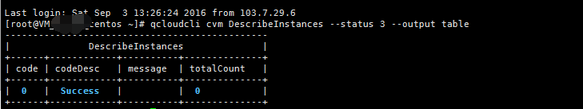
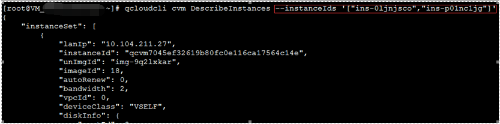
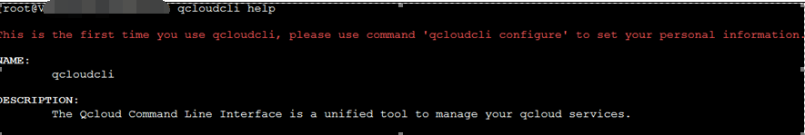
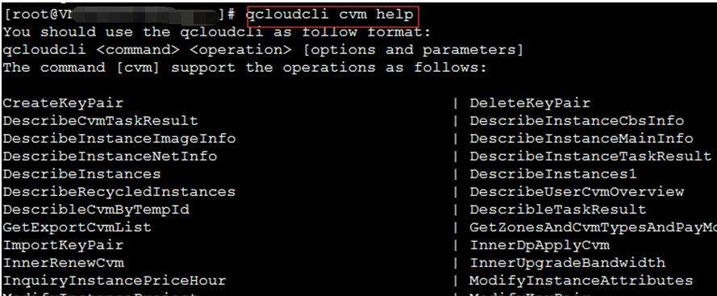
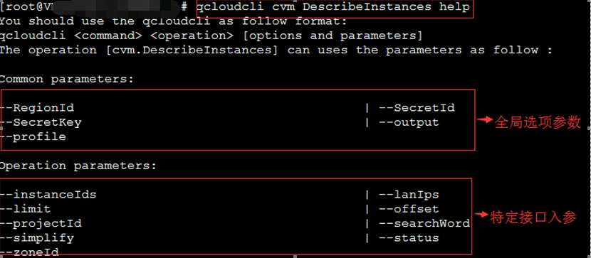

##快速使用命令行工具
##快速使用命令行工具
###调用格式
您应该按照qcloudcli <command> <operation> [options and parameters]的格式使用命令行工具，其中：
command是命令即模块名，如cvm、cdb、lb等；
operation是对应模块支持的操作即接口名称；
parameters是对应operation接口所支持的传入参数，格式是：--参数名称 参数取值
Options是全局选项，可以指定结果的输出格式、使用的用户等，格式是：--选项名称 选项取值
一个典型例子如下：
```
$ qcloudcli cvm DescribeInstances --status 3 --output table\
```
此命令以table格式输出默认账户的状态为3的cvm实例信息，其中模块名为cvm，接口名为DescribeInstances，只设置了一个入参status为3，设置了最终结果以table的形式进行输出（而不是qcloudcli configure时设置的默认输出形式json）

###JSON格式作为入参
qcloudcli允许JSON格式数据作为入参，一个典型例子如下：
```
qcloudcli cvm DescribeInstances --instanceIds '["ins-0ljnjsco","ins-p01nc1jg"]'
```
该命令输出默认账户下instanceId为ins-0ljnjsco和ins-p01nc1jg的两个实例。


注意：在Windows Command Processer 环境下, 双引号(")需要用反斜杠(\)方式表示，同时在用双引号(")将整个Json值括住。
例如:
```
C:\Users\test>qcloudcli cvm DescribeInstances --instanceIds “[\"ins-0ljnjsco\",\"ins-p01nc1j\"]"
```
如果是Windows PowerShell那么请用单引号(')加上反斜杠(\)方式来表示。
例如:
```
qcloudcli cvm DescribeInstances --instanceIds '[\"ins-0ljnjsco\",\"ins-p01nc1jg\"]'
```
###帮助和错误提示
在任何情况下，当您输入错误或输入--help、-h或help命令时，会显示相应的帮助文档。
####主命令（qcloudcli）帮助
当您在主命令（qcloudcli）模式下输入帮助时，会显示简要的命令行功能介绍（当您第一次使用qcloudcli时，会提示您用qcloudcli configure命令设置账户信息）：

####命令（command）模式帮助
当您在命令（command）模式下输入帮助时，会显示当前命令（模块）支持的所有操作（接口）：

####接口（operation）模式帮助
当您在接口模式下输入帮助时，会显示当前操作支持的所有输入参数以及全局选项：
 
其中全局选项参数的含义如下：
--RegionId 指定这次调用接口的地域信息，可选gz,hk,ca,sh,shjr,bj,sg；                      
--SecretId 指定这次调用接口使用的SecretId； 
--SecretKey 指定这次调用接口使用的SecretKey；                      	
--output 指定这次调用接口的输出格式，支持josn,table,text；
--profile 指定这次调用接口所用的账户（具体的账户信息用qcloudcli configure --profile XXX或qcloudcli addprofile命令设置）。

