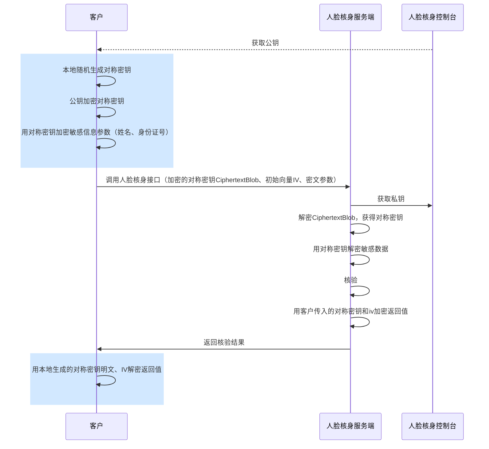

此指引适用于使用人脸核身服务接口，需要对传输敏感数据进行加密的场景。
如果您在2023年3月17日前已开通 KMS 加密服务，可继续使用腾讯云密钥管理系统 KMS 安全保护的主密钥 CMK 作为加密密钥，请查看 [KMS 加密指引](https://cloud.tencent.com/document/product/1007/95088) 文档。

**如果您使用的开发语言是Java、Go、Nodejs，推荐使用 [方式一](#STEP1) 实现加解密。如果开发语言不在上述范围，推荐使用 [方式二](#STEP2) 实现加解密功能。**

###  方式一：使用官方 SDK 实现加解密（推荐）[](id:STEP1)
官方 SDK 当前支持 Java、Go、Nodejs 开发语言，使用步骤如下：
### 获取加解密 SDK
**Java**
[获取依赖](https://github.com/TencentCloud/faceid-api-crypto-java/releases)  
[Demo](https://github.com/TencentCloud/faceid-api-crypto-java)

**Golang**
[获取依赖](https://github.com/TencentCloud/faceid-api-crypto-golang)
[Demo](https://github.com/TencentCloud/faceid-api-crypto-golang)


###  使用 SDK
#### 引入公共依赖
```xml
<dependency>
    <groupId>org.bouncycastle</groupId>
    <artifactId>bcprov-jdk15on</artifactId>
    <version>1.70</version>
</dependency>
<dependency>
    <groupId>org.bouncycastle</groupId>
    <artifactId>bcpkix-jdk15on</artifactId>
    <version>1.70</version>
</dependency>
```

#### 引入加解密 SDK
下载最新的 [release](https://github.com/TencentCloud/faceid-api-crypto-java/releases) 版本 jar 包，并在项目工程中引入。
参考下方的接口 Demo 实现敏感信息加解密功能。

#### 接口敏感信息加解密 DEMO
- 实名核身鉴权：[DetectAuth](https://github.com/TencentCloud/faceid-api-crypto-java/blob/main/crypto-example%2Fsrc%2Fmain%2Fjava%2Fcom%2Ftencentcloud%2Ffaceid%2Fexample%2FDetectAuth.java)
- 获取实名核身结果信息增强版：[GetDetectInfoEnhanced](https://github.com/TencentCloud/faceid-api-crypto-java/blob/main/crypto-example/src/main/java/com/tencentcloud/faceid/example/GetDetectInfoEnhanced.java)
- 获取E证通 Token：[GetFaceIdToken](https://github.com/TencentCloud/faceid-api-crypto-java/blob/main/crypto-example/src/main/java/com/tencentcloud/faceid/example/GetFaceIdToken.java)
- 照片人脸核身：[ImageRecognition](https://github.com/TencentCloud/faceid-api-crypto-java/blob/main/crypto-example/src/main/java/com/tencentcloud/faceid/example/ImageRecognition.java)
- 银行卡四要素核验：[BankCard4EVerification](https://github.com/TencentCloud/faceid-api-crypto-java/blob/main/crypto-example/src/main/java/com/tencentcloud/faceid/example/BankCard4EVerification.java)
- 银行卡三要素核验：[BankCardVerification](https://github.com/TencentCloud/faceid-api-crypto-java/blob/main/crypto-example/src/main/java/com/tencentcloud/faceid/example/BankCardVerification.java)
- 银行卡基础信息查询：[CheckBankCardInformation](https://github.com/TencentCloud/faceid-api-crypto-java/blob/main/crypto-example/src/main/java/com/tencentcloud/faceid/example/CheckBankCardInformation.java)
- 身份信息及有效期核验：[CheckIdNameDate](https://github.com/TencentCloud/faceid-api-crypto-java/blob/main/crypto-example/src/main/java/com/tencentcloud/faceid/example/CheckIdNameDate.java)
- 手机号二要素核验：[CheckPhoneAndName](https://github.com/TencentCloud/faceid-api-crypto-java/blob/main/crypto-example/src/main/java/com/tencentcloud/faceid/example/CheckPhoneAndName.java)
- 身份证识别及信息核验：[IdCardOCRVerification](https://github.com/TencentCloud/faceid-api-crypto-java/blob/main/crypto-example/src/main/java/com/tencentcloud/faceid/example/IdCardOCRVerification.java)
- 身份证二要素核验：[IdCardVerification](https://github.com/TencentCloud/faceid-api-crypto-java/blob/main/crypto-example/src/main/java/com/tencentcloud/faceid/example/IdCardVerification.java)
- 手机号在网时长核验：[MobileNetworkTimeVerification](https://github.com/TencentCloud/faceid-api-crypto-java/blob/main/crypto-example/src/main/java/com/tencentcloud/faceid/example/MobileNetworkTimeVerification.java)
- 手机号状态查询：[MobileStatus](https://github.com/TencentCloud/faceid-api-crypto-java/blob/main/crypto-example/src/main/java/com/tencentcloud/faceid/example/MobileNetworkTimeVerification.java)
- 手机号三要素核验：[PhoneVerification](https://github.com/TencentCloud/faceid-api-crypto-java/blob/main/crypto-example/src/main/java/com/tencentcloud/faceid/example/PhoneVerification.java)
- 手机号三要素核验（移动）：[PhoneVerificationCMCC](https://github.com/TencentCloud/faceid-api-crypto-java/blob/main/crypto-example/src/main/java/com/tencentcloud/faceid/example/PhoneVerificationCMCC.java)
- 手机号三要素核验（电信）：[PhoneVerificationCTCC](https://github.com/TencentCloud/faceid-api-crypto-java/blob/main/crypto-example/src/main/java/com/tencentcloud/faceid/example/PhoneVerificationCTCC.java)
- 手机号三要素核验（联通）：[PhoneVerificationCUCC](https://github.com/TencentCloud/faceid-api-crypto-java/blob/main/crypto-example/src/main/java/com/tencentcloud/faceid/example/PhoneVerificationCUCC.java)


### 方式二：不使用官方 SDK 实现加解密[](id:STEP2)
### 加解密流程说明
- 当前敏感信息加解密支持标准加密算法 AES-CBC 和国密算法 SM4-GCM，可以根据业务要求从中选择适合您的加密算法。
- 敏感信息加解密的本质是对接口传输的姓名、身份证号做对称加密后传输，人脸核身服务收到加密数据后先解密，然后在进行核身业务。如果人脸核身接口返回结果涉及敏感信息，则会使用相同的对称密钥加密，调用方在收到接口响应时需要对敏感信息解密。
- 对称密钥由调用方本地随机生成，为保证对称密钥的安全传输，需要调用方配合使用非对称加密算法加密对称密钥。加密的公钥可以登录 人脸核身控制台 获取。




### 使用 AES-256-CBC 算法
#### 加载 RSA 公钥
加载 RSA 公钥：对控制台获取到的公钥字符串先做 Base64 Decode，然后按对应格式加载。
- 格式：PKCS1
- 保存格式：pem 格式 Base64编码
- 长度：1024
```go
// 加载RSA公钥
bytes, err := base64.StdEncoding.DecodeString(publicKey)
if err != nil {
	return nil, err
}
block, _ := pem.Decode(bytes)
x509.ParsePKCS1PublicKey(block.Bytes)
```

#### 生成对称密钥和向量[](id:key1)
随机生成32字节长度的对称密钥以及16字节的初始向量，初始向量表示为 IV。
```go
// 生成对称密钥
key := make([]byte, 32)
rand.Read(key)

// 生成16字节iv
iv := make([]byte, 16)
rand.Read(iv)
```

#### RSA 公钥加密对称密钥
使用 RSA 公钥加密前面生成的 [对称密钥](#key1)，将加密后的结果表示为 CiphertextBlob。
```go
// 加密对称密钥Key
buffer := bytes.Buffer{}
bytes, _ := rsa.EncryptPKCS1v15(rand.Reader, publicKey, key)
buffer.Write(bytes)
buffer.Bytes()
```


#### 加密敏感数据
使用前面生成的 [对称密钥和初始向量](#key1)，采用 AES-256-CBC 算法加密敏感数据（姓名、身份证号）。
```go
// AES-CBC加密明文数据
// 明文密钥key
// 初始向量iv
// 敏感数据plaintext
block, _ := aes.NewCipher(key)
blockSize := block.BlockSize()
pkcs7 := func(cipherText []byte, blockSize int) []byte {
	padding := blockSize - len(cipherText)%blockSize
	padText := bytes.Repeat([]byte{byte(padding)}, padding)
	return append(cipherText, padText...)
}
plaintext = pkcs7(plaintext, blockSize)
blockMode := cipher.NewCBCEncrypter(block, iv)
ciphertext := make([]byte, len(plaintext))
blockMode.CryptBlocks(ciphertext, plaintext)
fmt.Print(ciphertext)
```

#### 调用人脸核身接口
以身份证二要素（[IdCardVerification](https://cloud.tencent.com/document/product/1007/33188)）接口为例：
原始数据为：
```json
{
    "Action": "IdCardVerification",
    "Version": "2018-03-01",
    "IdCard": "100822119610104046",
    "Name": "张三"
}
```
**CiphertextBlob**、IV、TAG、加密后的姓名、身份证号在传输前均需要做一次 Base64 编码：
- 生成的对称密钥为：1abrmh7jz83awn4585vzujiyxbhi5wsd（32字节）
- 生成的初始向量（IV）：t9Uf9QJ50B0uHhE26JLNxw==（16字节IV，Base64编码）

公钥加密后的对称密钥（CiphertextBlob）：eqB5H23bbNQGTxCxSHP+FaXy+LlfK2GJ8l19UxTbikdezY1mGINQxS76J9rUa61W2jrm4j6eQ39O9pus/Wk5zP6t48Gd8M6RHld17/pPTnAVzjTwYZhy0yBvuyh7N73J5/fL2TSgJTMVi79urCC17C0oYdyBsK+hP9bIfzwxb3g=（Base64编码）

使用对称密钥加密IdCard和Name，加密后的结果分别为：
- IdCard：H+ZwsBfYVgbBWaHStriUV2GF0wX7MzYy0XMWNKZjZjQ=（Base64编码）
- Name：IS6wLE153MfBr639hqWmUQ==（Base64编码）

最终加密后的接口数据为：
```json
{
    "Action": "IdCardVerification", 
    "Version": "2018-03-01",
    "IdCard": "H+ZwsBfYVgbBWaHStriUV2GF0wX7MzYy0XMWNKZjZjQ=", // 加密后的身份证号
    "Name": "IS6wLE153MfBr639hqWmUQ==", // 加密后的姓名
    "Encryption": {
        "EncryptList": [ // 用于标记加密字段
            "IdCard",
            "Name"
        ],
        "CiphertextBlob":  "eqB5H23bbNQGTxCxSHP+FaXy+LlfK2GJ8l19UxTbikdezY1mGINQxS76J9rUa61W2jrm4j6eQ39O9pus/Wk5zP6t48Gd8M6RHld17/pPTnAVzjTwYZhy0yBvuyh7N73J5/fL2TSgJTMVi79urCC17C0oYdyBsK+hP9bIfzwxb3g=", // 加密后的对称密钥
        "Iv": "t9Uf9QJ50B0uHhE26JLNxw==", // 加密初始向量
        "Algorithm": "AES-256-CBC" // 采用的加密算法
    }
}
```

### 使用 SM4-GCM 算法

#### 加载 SM2公钥
加载 SM2公钥：对控制台获取到的公钥字符串先做 Base64 Decode，然后按对应格式加载。
- 格式：PKCS8
- 保存格式：pem格式Base64编码
- 长度：512

```go
// 加载SM2公钥
bytes, err := base64.StdEncoding.DecodeString(publicKey)
if err != nil {
	return nil, err
}
x509.ReadPublicKeyFromPem(bytes)
```


#### 生成对称密钥和向量[](id:key2)
随机生成16字节长度的对称密钥以及12字节的初始向量，初始向量表示为 IV。
```go
// 生成对称密钥
key := make([]byte, 16)
rand.Read(key)

// 生成16字节iv
iv := make([]byte, 12)
rand.Read(iv)
```

#### SM2公钥加密对称密钥
使用 SM2公钥加密前面生成的 [对称密钥](#key2)，将加密后的结果表示为 CiphertextBlob
- 注意输出密文时采用 C1C3C2数据拼接方式
- 数据类型转换时，均使用 PC=04的方式，即未压缩。

```go
// 加密对称密钥Key
ciphertext, err := sm2.Encrypt(publicKey, plaintext, rand.Reader, sm2.C1C3C2)
if err != nil {
	return nil, err
}
return cipherText, nil
```

#### 加密敏感数据
使用前面生成的 [对称密钥和初始向量](#key2)，采用 SM4-GCM 算法加密敏感数据（姓名、身份证号）。
```go
// SM4-GCM加密明文数据
// 明文密钥key
// 初始向量iv
// 敏感数据plaintext
block, err := sm4.NewCipher(key)
if err != nil {
	return nil, nil, err
}
gcm, err := cipher.NewGCM(block)
if err != nil {
	return nil, nil, err
}
ciphertext := gcm.Seal(nil, iv, plaintext, nil)
tag := ciphertext[len(ciphertext)-gcm.Overhead():]
ciphertextWithoutTag := ciphertext[:len(ciphertext)-gcm.Overhead()]
return ciphertextWithoutTag, tag, nil
```

#### 调用人脸核身接口
以身份证二要素（[IdCardVerification](https://cloud.tencent.com/document/product/1007/33188)）接口为例：
原始数据为：
```json
{
    "Action": "IdCardVerification",
    "Version": "2018-03-01",
    "IdCard": "100822119610104046",
    "Name": "张三"
}
```

**CiphertextBlob、IV、TAG、加密后的姓名、身份证号在传输前均需要做一次Base64编码**
- 生成的对称密钥为：45c3royvhyj6cavv（16字节）
- 生成的初始向量（IV）：bIGEqJyU+8MIJO3u（12字节IV，Base64编码）

公钥加密后的对称密钥（CiphertextBlob）：BD1WkCZPN1Tn0jzNIZoHf1JHjBFDRRdVnj9UV9gETROOo+HhOJcQreZacgVyPqE+E4OqDvtu5cttXsIhztDV7uYJZmNdpFWnTnXtSgjXFvOf2n48gNMu5I0Ung5+VrDN2SzY2D9cetiuOFktsJEzTCs=（Base64编码）

使用对称密钥加密IdCard和Name，加密后的结果分别为：
- IdCard：8qjVE9kEqW7R3x3Nd5AM5PDb（Base64编码） Tag：wMyiG6JUzj4CIiZ+V5mqwA==（Base64编码）
- Name：JiRFz1O/（Base64编码）Tag：msgrOgSfnMEK1ZzPtcaaFg==（Base64编码）

最终加密后的接口数据为：
```json
{
    "Action": "IdCardVerification", 
    "Version": "2018-03-01",
    "IdCard": "8qjVE9kEqW7R3x3Nd5AM5PDb", // 加密后的身份证号
    "Name": "JiRFz1O/", // 加密后的姓名
    "Encryption": {
        "EncryptList": [ // 用于标记加密字段
            "IdCard",
            "Name"
        ],
      	"TagList": [ // 用于验证消息完整性
          	"wMyiG6JUzj4CIiZ+V5mqwA==",
          	"msgrOgSfnMEK1ZzPtcaaFg=="
        ],
        "CiphertextBlob":  "BD1WkCZPN1Tn0jzNIZoHf1JHjBFDRRdVnj9UV9gETROOo+HhOJcQreZacgVyPqE+E4OqDvtu5cttXsIhztDV7uYJZmNdpFWnTnXtSgjXFvOf2n48gNMu5I0Ung5+VrDN2SzY2D9cetiuOFktsJEzTCs=", // 加密后的对称密钥
        "Iv": "bIGEqJyU+8MIJO3u", // 加密初始向量
        "Algorithm": "SM4-GCM" // 采用的加密算法
    }
}
```

