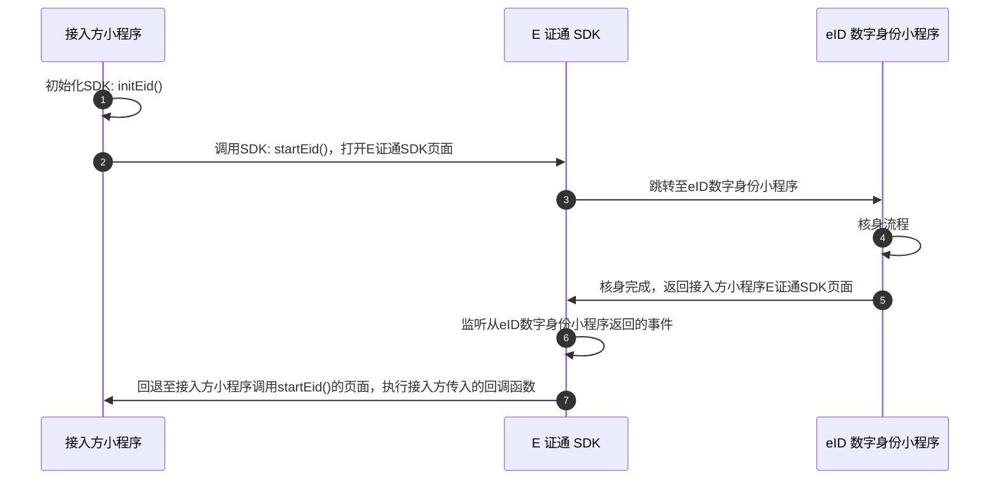

### 前置条件
1. 添加服务器域名白名单
小程序前端接口请求有域名白名单限制，未添加白名单的域名只能在调试模式下运行。接入方需要在小程序上线前需要将以下域名添加至服务器域名白名单：
```javascript
    // request 合法域名
    eid.faceid.qq.com
```
2. 添加业务域名白名单
在小程序配置业务域名中，将下载后的校验文件发给腾讯侧对接人员，待腾讯侧进行完相应的操作后，将以下域名添加至业务域名白名单：
```javascript
   eid.faceid.qq.com
```

### 安装 SDK
单击这里 [下载 E 证通 SDK ](https://faceid-ecard-1254418846.cos.ap-chengdu.myqcloud.com/cloud-mp-ecard-sdk-v1.0.0.zip) 服务，并将 E 证通小程序 SDK 文件夹放在小程序根目录下。

### SDK 调用步骤

**1. 初始化SDK**
在 app.js 文件中引入初始化SDK的方法 initEid; 
在 App.js 的 onLaunch() 中加入相应代码，在 App.json 文件里添加 E 证通 SDK 页面; 
在 onLaunch 方法中调用 initEid; 
```javascript
   //app.js
   import { initEid } from './mp_ecard_sdk/main';
  
   App({
       onLaunch() {
           initEid();
       },
   });
  
   // app.json
   {
       "pages":[
           "mp_ecard_sdk/index/index",
           "mp_ecard_sdk/protocol/service/index",
           "mp_ecard_sdk/protocol/privacy/index",
           "mp_ecard_sdk/protocol/userAccredit/index",
           "mp_ecard_sdk/protocol/eid/index",
       ]
   }
```

**2. 获取 EidToken**
接入方服务端调用获取 E 证通 Token [GetEidToken](https://cloud.tencent.com/document/product/1007/54089) 接口，传入 E 证通服务所需信息获取到 EidToken。

**3. 调用 SDK**
在需要进行E证通核身的地方引入调用 SDK 的方法 startEid; 
在业务需要的时机触发 startEid; 


startEid() 参数说明：
- `startEid(options)`：进入实名认证页面。
- `options`：Object required 接入方传入的参数。	
- `options.data.token`：String required 接入方小程序从接入方服务端获取的 EidToken。
- `options.verifyDoneCallback`：Function(res) required 核身完成的回调。res 包含验证成功的 token，是否完成的布尔值标志 verifyDone。请根据 res 返回的结果进行业务处理判断。

**4. 获取 E 证通核验结果信息**
用户完成人脸核身后，会以回调形式返回 EidToken 以及其他信息，接入方小程序将 EidToken 传给接入方的服务端，接入方服务端即可凭借 EidToken 参数调用获取小程序核身结果信息 [GetEidResult](https://cloud.tencent.com/document/product/1007/54090) 接口去获取本次核身的详细信息，最后将核身结果返回给接入方小程序。

> ?EidToken 作为一次核身流程的标识，有效时间为7,200秒；完成核身后，可用该标识获取3天内验证结果信息。


### 卸载 SDK
删除 mp_ecard_sdk 文件夹。

## 小程序接入时序图


## 注意事项

1. 从 eID 数字身份小程序返回接入方小程序。
当接入方小程序在初始化 E 证通 SDK 的时候，E 证通 SDK 会通过 wx.onAppShow 注册一个监听从 eID 数字身份小程序跳转回接入方小程序的事件，从而根据情况触发接入方传入的核身完成的回调函数。
2. 由于微信的机制，用户在 eID 数字身份小程序跳转回接入方小程序的时候，同时也会触发接入方小程序 app.js 中的 onShow 方法。为了避免冲突，如果接入方小程序在 onShow 中有执行逻辑的话，需要排除掉从 eID 数字身份小程序跳转回接入方小程序这个场景。
3. 可通过以下方法实现：
```javascript
    // app.js

    onShow(options) {
        const { referrerInfo, scene } = options;
        /* 判断是否从eID数字身份小程序返回 */
        const { appId } = referrerInfo;
        if (scene === 1038 && appId === 'wx0e2cb0b052a91c92') {
            return;
        } else {
            // 执行接入方小程序原本的逻辑
        }
    },

```

