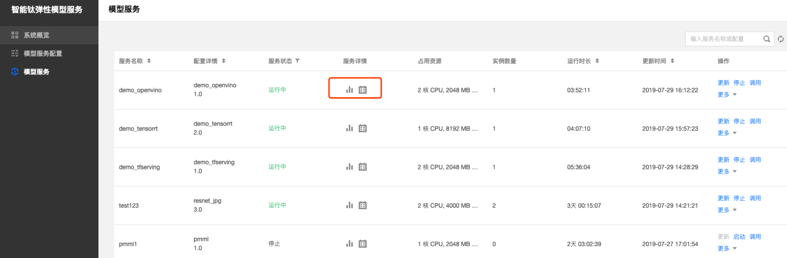
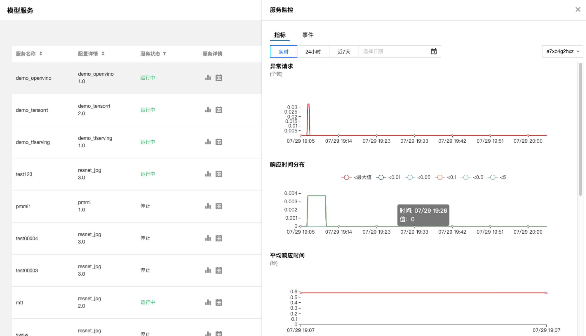
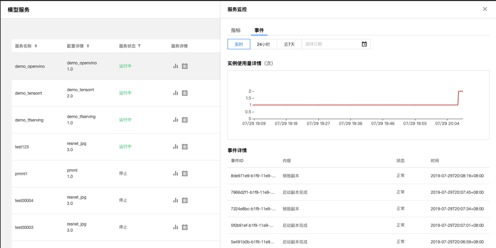
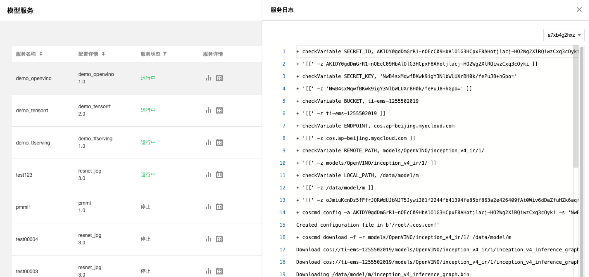

# 监控与日志
## 监控
TI-EMS提供模型服务的监控能力，用户可通过监控数据窗口了解各服务的运行状况和实例变化情况。TI-EMS的监控窗口包括服务监控和事件监控。

在模型服务列表页面，找到您想要进行监控的服务，【服务详情】一栏下，单击监控图标，即可展示模型服务的监控窗口。

- 服务监控

TI-EMS的服务监控窗口包括QPS（每秒响应请求次数）、异常请求个数、响应时间分布、平均响应时间、网络流量、CPU使用率、GPU使用率、MEM使用率等基础数据统计。

- 事件监控

TI-EMS的事件监控窗口主要记录服务实例的扩展事件，通过记录事件ID、内容、状态和时间来查看服务在一段时间内的实例扩缩情况。

> 说明：

> 1. 在【监控】视窗，可切换时间粒度分别为实时、24小时、近7天和自定义时间区间。
> 2. 通过窗口右上角的实例下拉框，可切换查看不同实例的监控统计数据。

## 日志
TI-EMS支持查看单个服务不同实例的日志，用户可通过日志数据窗口查看各服务的运行日志。

