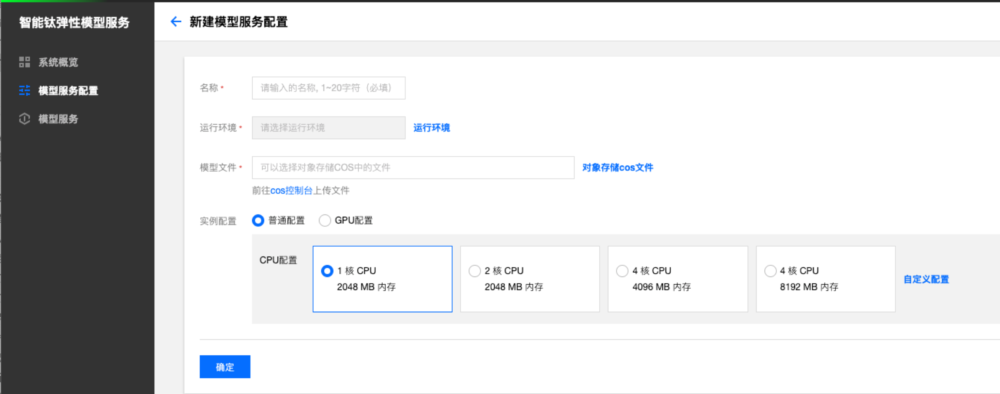
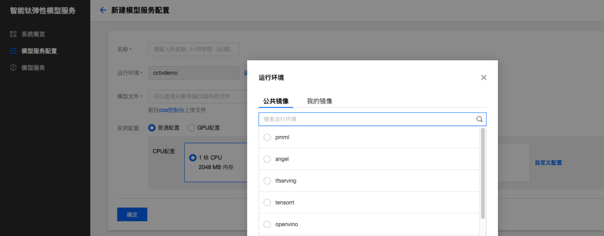
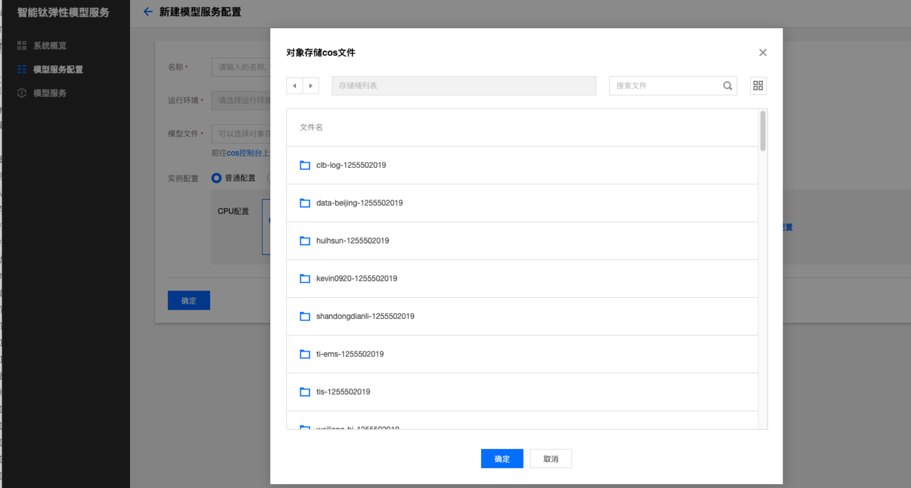
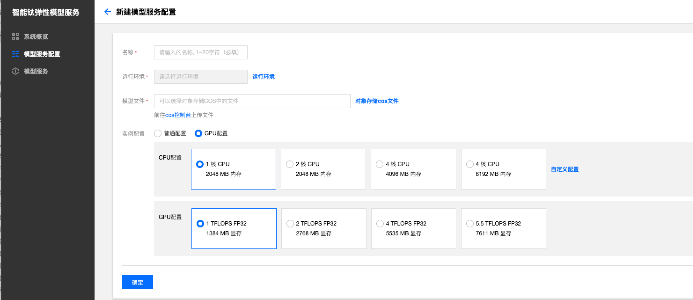

# 创建模型服务配置
## 角色授权

首次登录智能钛弹性模型服务控制台您将会看到服务角色授权页面。
单击【前往访问管理】，您将跳转到腾讯云 CAM 控制台进行角色登录授权。

单击【同意授权】，将创建服务角色并授予智能钛弹性模型服务相关权限以访问您的云资源（对象存储等服务）

授权成功后，将返回智能钛弹性模型服务控制台。单击【新建模型服务配置】，开始进行模型服务配置操作。

>!智能钛弹性模型服务目前只支持主账号一键授权。

## 创建模型服务配置



**名称：** 要创建的模型服务配置的名称，不超过20个字符。

**选择运行环境：** 单击【运行环境】，可选择模型运行的公共环境。智能钛弹性模型服务提供 Tensorflow、PMML、TensorRT、OpenVINO 和 Angel五种模型服务运行环境，相关介绍请详见[模型运行环境介绍](/Locations/TI-EMS公有云/TI-EMS操作指南/模型服务配置/模型运行环境介绍.txt)。


**配置模型文件：** 模型文件需要首先上传到 [腾讯云对象存储 COS](https://console.cloud.tencent.com/cos5/bucket)，模型文件配置支持直接输入文件夹所在COS路径和通过文件选择界面选择模型文件夹两种方式。

- 输入模型文件夹COS路径

您可以直接在模型文件输入框输入模型文件夹COS路径，其中模型地址格式为：

```cos://${bucket_name}-${appid}.cos.{region}.myqcloud.com/模型文件夹路径/```

- 通过文件选择界面确定路径

点击【对象存储cos文件】按钮，进入cos文件选择界面，TI-EMS会读取您所有的COS对象存储文件，您只需通过文件选择界面找到对应的模型文件夹，并且点击【确定】按钮，即可配置相应的模型文件路径。

> 由于TI-EMS支持的模型文件路径最后一级为模型文件夹路径，因此通过文件选择界面需要选定路径为模型文件的上一层文件夹路径。

- 模型文件路径选择示例

模型文件在COS中的路径位置如下图：

该模型文件夹对应的COS路径为：

```cos://demo-1256935566.cos.ap-beijing.myqcloud.com/inception_v3/1/```

在文件选择界面，选定模型文件的上一层文件夹路径（注意不要选定模型文件），点击【确定】。

**实例资源配置：** 智能钛弹性模型服务针对不同的模型服务运行资源需求为您提供了【普通应用】和【GPU 应用】，选择【普通应用】，您需要指定模型服务单实例运行所需使用的 CPU 核与内存，您可以直接选择推荐的应用配置组合，也可以进行自定义配置。选择【GPU 应用】，您需要指定模型服务单实例运行所需使用的 CPU 核与内存，以及 GPU 算力配置。


单击【确认】，模型服务单实例配置完成，随即跳转到模型服务配置列表页面。

> 新建模型服务配置版本号自动为1.0,后续每新增一个配置版本，版本号自动加1。


