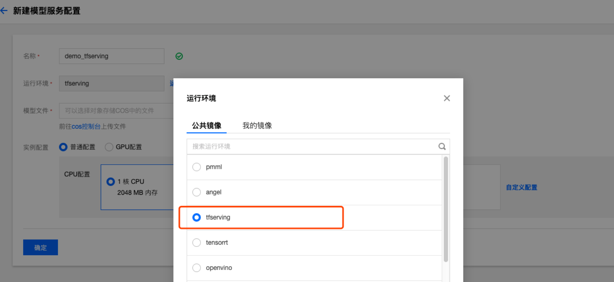
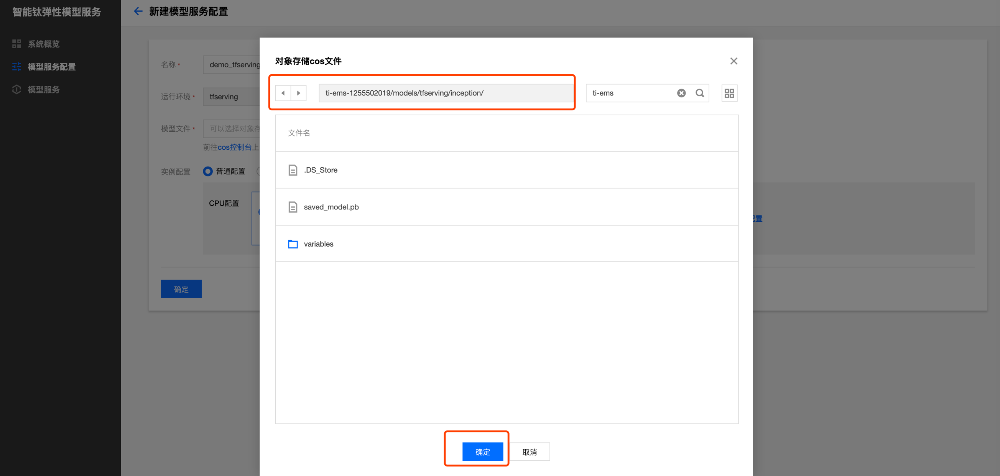
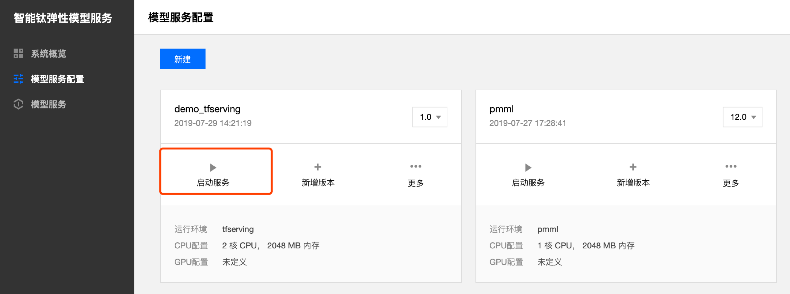
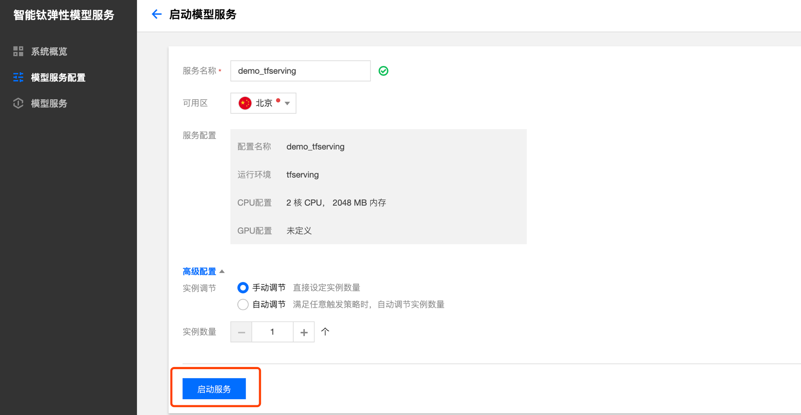

# 调用 TensorFlow 模型部署的服务
## 准备内容

1.经典深度学习 inception 模型：[inception_model.zip](http://ti-ems-1255502019.cosbj.myqcloud.com/tfserving/inception/inception_model.zip)

> 注：我们已经为您准备好了上述inception模型的cos访问地址：
>  cos://ti-ems-1255502019.cos.ap-beijing.myqcloud.com/models/tfserving/inception/。您可以输入该cos地址，也可以将模型文件夹下载下来，解压上传到自己的cos存储桶中，并在【创建模型服务配置】页面选择相应的模型文件夹。

2.测试图片: [flower.jpg](http://ti-ems-1255502019.cosbj.myqcloud.com/test-data/tfserving_data/flower.jpg)


- base64编码

base 64 命令行工具可以将二进制图片编码为ASCII文本数据，大多数开发环境都包含原生base 64 命令行工具，要对图片文件进行编码，执行以下操作：

```shell
echo "{\"instances\":[{\"b64\": \"$(base64 -i flower.jpg)\"}]}" | tee flower.json

```
我们将上图测试花朵图片按照inception模型定义的JSON数据格式`{"instances":[{"b64": 图片 base64 编码}]}`进行编码，将jpg转换成base64。`flower.json`为经过编码的测试图片数据。


## 创建模型服务配置

在模型服务配置页面单击【新建】，进入模型服务配置新建页面，输入配置名称:demo_tfserving，点击【运行环境】，在弹出页面的【公共镜像】栏选择tfserving。



点击【对象存储cos文件】，弹出cos文件选择页面，选择inception模型文件夹所在的路径，单击【确定】。



选择模型资源配置，单击【普通配置】，选择2核CPU，2048MB内存配置项。模型服务配置创建完成之后，单击【确定】，进入模型服务配置页面。
## 启动服务

在模型服务配置页面找到demo_tfserving配置，单击配置卡片的【启动服务】按钮，进入启动服务页面。



在启动服务页面选择手动调节实例，实例数量设为1，单击【启动服务】，进行模型服务列表页面。



## 调用测试
找到demo_serving模型服务，在对应的【操作】列单击【调用】，即可获得demo_serving模型服务的访问地址IP和密钥TOKEN。


这里使用 curl 工具为例，展示如何调用服务接口：

```shell
	curl -H "Content-Type: application/json" \
	-H "x-Auth-Token: TOKEN" \
	-X POST IP/v1/models/m:predict -d @flower.json
```

- 调用参数说明

TOKEN：通过点击模型服务页面的【服务调用】获取的密钥地址token

IP：通过点击模型服务页面的【服务调用】获取的服务访问地址

返回结果：

```shell
{
    "predictions": [
        {
            "class_idx": 2,
            "probabilities": [0.00685295, 0.00298388, 0.965622, 0.00721011, 0.0173306],
            "classes": "roses"
        }
    ]

```

可以看出模型服务运行正常，并且正确的对发送的花朵进行了分类。

- 参考

[TensorFlow 模型服务文档](https://www.tensorflow.org/tfx/serving/api_rest)
