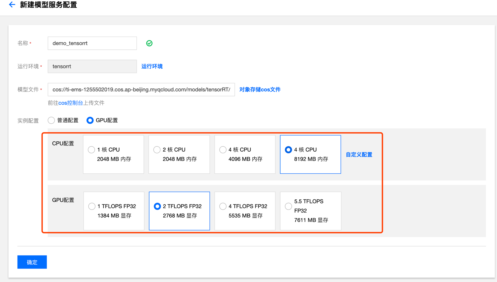
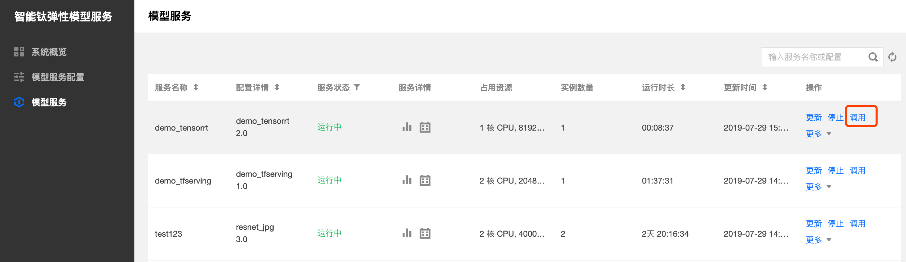

# 调用 TensorRT 镜像模型服务
## 准备内容

1.经典深度学习 inception 模型：[inception_v3.tar](http://inception-v3-1255502019.coscd.myqcloud.com/inception_v3.tar)

> 注：我们已经为您准备好了上述inception模型的cos访问地址：
>  cos://ti-ems-1255502019.cos.ap-beijing.myqcloud.com/models/tensorRT/inception_v3/1/。您可以输入该cos地址，也可以将模型文件夹下载下来，解压上传到自己的cos存储桶中，并在【创建模型服务配置】页面选择相应的模型文件夹。

2.测试图片: [imagenet_230.tar](http://ti-ems-1255502019.cosbj.myqcloud.com/test-data/imagenet_230.tar)（ImageNet label为230的图片）
## 创建模型服务配置

在模型服务配置页面单击【新建】，进入模型服务配置新建页面，输入配置名称:demo_tensorrt，点击【运行环境】，在弹出页面的【公共镜像】栏选择tensorrt。


点击【对象存储cos文件】，弹出cos文件选择页面，选择inception_v3模型文件夹所在的路径，单击【确定】。


选择模型资源配置，单击【GPU配置】，选择 4CPU核8G内存, 2TFLOPS配置项。模型服务配置创建完成之后，单击【确定】，进入模型服务配置页面。



## 启动服务

在模型服务配置页面找到demo_tensorrt配置，单击配置卡片的【启动服务】按钮，进入启动服务页面。


在启动服务页面选择手动调节实例，实例数量设为1，单击【启动服务】，进行模型服务列表页面。


## 获得访问地址和密钥
找到demo_tensorrt模型服务，在对应的【操作】列单击【调用】，即可获得demo_tensorrt模型服务的访问地址IP和密钥TOKEN。




## 获得模型元数据


使用如下命令获取模型元数据：

```shell
curl -H "X-Auth-Token: TOKEN" ip:80/v1/models/m/metadata
```

调用参数说明：

TOKEN：通过点击模型服务页面的【服务调用】获取的密钥地址token

IP：通过点击模型服务页面的【服务调用】获取的服务访问地址

## 调用模型服务接口

TI-EMS模型服务支持以gRPC或HTTP访问，本示例使用gRPC访问模型服务。

- 下载服务调用示例脚本

```shell 
git clone https://github.com/ti-ems/client-examples.git
```

```shell
cd client-examples
```

- 安装测试脚本依赖

测试脚本需要在python环境下运行，运行前需要配置环境，requirements.txt是运行测试脚本所需要的依赖库清单：

```shell
tensorflow-serving-api==1.13.0
tensorflow==1.13.1
grpcio==1.22.0
requests==2.22.0
numpy==1.16.3
opencv-python==4.1.0.25
```

使用如下命令行一键安装测试脚本所依赖的运行环境

```shell
pip install -r requirements.txt
```


- 运行客户端脚本

因为需要动态生成优化内核，TensorRT镜像首次调用模型服务，根据模型大小不同可能需要等待0.5-5分钟.

```shell
python grpc_client.py --server IP --TOKEN --data_dir DATA_DIR
```

IP：服务访问地址

TOKEN：服务密钥

DATA_DIR: 测试数据集所在路径

> 具体模型可能会输入数据类型不同，数据shape不同，数据需要预处理等，请根据具体模型设计相应访问程序。

TI-EMS使用过程中遇到的任何问题，欢迎加入[智能钛AI开发者社区](https://cloud.tencent.com/developer/timl/ask)，与腾讯云AI专家和众多AI爱好者交流技术。
更多客户端程序，请访问：`https://github.com/ti-ems/client-exmaples`。

