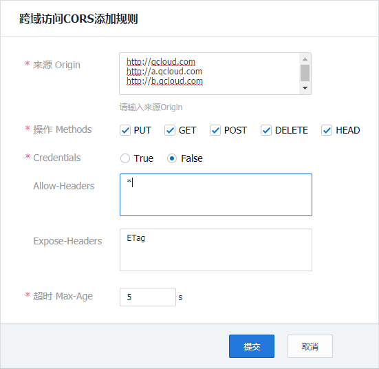
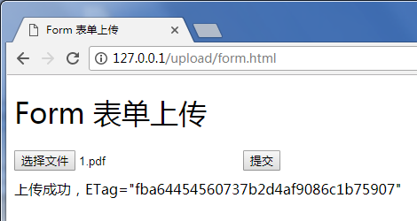

# Web简单上传实践

本文档介绍如何不依赖 SDK，用简单的代码，在网页直传文件到 COS 的存储桶（以下内容基于 XML API）。

## 一、前期准备

1. 到 [COS对象存储控制台](https://console.qcloud.com/cos4) 创建存储桶，得到 Bucket（存储桶名称） 和 Region（地域名称）
2. 到 [控制台密钥管理](https://console.qcloud.com/capi) 获取您的项目 SecretId 和 SecretKey
3. 配置 CORS 规则，配置例子如下图：



## 二、计算签名

由于签名计算放在前端会暴露 SecretId 和 SecretKey，我们把签名计算过程放在后端实现，前段通过 ajax 向后端获取签名结果，正式部署时请再后端加一层自己网站本身的权限检验。

这里提供 [PHP 和 NodeJS 的签名例子](https://github.com/tencentyun/cos-js-sdk-v5/blob/master/server/)，其他语言，请参照对应的 [XML SDK](https://cloud.tencent.com/document/product/436/6474)

## 三、前端上传

### 方案A：使用 ajax 上传

Ajax 上传需要浏览器支持基本的 Html5 特性，当前方案使用的是 [XML API 的 PutObject 接口](https://cloud.tencent.com/document/product/436/7749)

1. 按照上文【前期准备】，准备好存储桶
2. 创建 ajax.html，填充下面的代码，修改里面的 Bucket 和 Region
3. 部署好后端的签名服务，并修改 ajax.html 里的签名服务地址
4. 把 ajax.html 放在 Web 服务器下，然后在浏览器访问页面，测试文件上传

```html
<!doctype html>
<html lang="en">
<head>
    <meta charset="UTF-8">
    <title>Ajax 上传</title>
    <style>h1, h2 {font-weight: normal;}#msg {margin-top:10px;}</style>
</head>
<body>

<h1>Ajax 上传</h1>

<form id="form">
    <input id="file" type="file">
    <input type="submit">
</form>

<div id="msg"></div>

<script>
    (function () {

        // 指定存储桶
        var AppId = '1250000000';
        var Bucket = 'test';
        var Region = 'ap-guangzhou';
        var prefix = 'http://' + Bucket + '-' + AppId + '.cos.' + Region + '.myqcloud.com/';

        // 计算签名
        var getAuthorization = function (options, callback) {
            var method = (options.Method || 'get').toLowerCase();
            var key = options.Key || '';
            var pathname = key.indexOf('/') === 0 ? key : '/' + key;
            var url = '../server/auth.php?method=' + method + '&pathname=' + encodeURIComponent(pathname);
            var xhr = new XMLHttpRequest();
            xhr.open('GET', url, true);
            xhr.onload = function (e) {
                callback(null, e.target.responseText);
            };
            xhr.onerror = function (e) {
                callback('获取签名出错');
            };
            xhr.send();
        };

        // 上传文件
        var uploadFile = function (file, callback) {
            var Key = file.name;
            getAuthorization({Method: 'PUT', Key: Key}, function (err, auth) {
                var url = prefix + Key;
                var xhr = new XMLHttpRequest();
                xhr.open('PUT', url, true);
                xhr.setRequestHeader('Authorization', auth);
                xhr.onload = function () {
                    if (xhr.status === 200 || xhr.status === 206) {
                        var ETag = xhr.getResponseHeader('etag');
                        callback(null, {url: url, ETag: ETag});
                    } else {
                        callback('文件 ' + Key + ' 上传失败，状态码：' + xhr.status);
                    }
                };
                xhr.onerror = function () {
                    callback('文件 ' + Key + ' 上传失败，请检查是否没配置 CORS 跨域规则');
                };
                xhr.send(file);
            });
        };

        // 监听表单提交
        document.getElementById('form').onsubmit = function (e) {
            var file = document.getElementById('file').files[0];
            file && uploadFile(file, function (err, data) {
                console.log(err || data);
                document.getElementById('msg').innerText = err ? err : ('上传成功，ETag=' + data.ETag);
            });
            e.preventDefault();
        };
    })();
</script>

</body>
</html>
```

执行效果如下图：


### 方案B：使用 form 表单上传

Form 表单上传可以支持低版本的浏览器比如 ie8 的上传，当前方案使用的是 [XML API 的 PostObject 接口](https://cloud.tencent.com/document/product/436/7751)

1. 按照上文【前期准备】，准备好存储桶
2. 创建 form.html，填充下面的代码，修改里面的 AppId、Bucket 和 Region
3. 部署好后端的签名服务，并修改 form.html 里的签名服务地址
4. 在 form.html 同一个目录下创建一个空的 empty.html，用于上传成功时跳转回来
5. 把 form.html 和 empty.html 放在 Web 服务器下，然后在浏览器访问页面，测试文件上传

```html
<!doctype html>
<html lang="en">
<head>
    <meta charset="UTF-8">
    <title>Form 表单上传</title>
    <style>h1, h2 {font-weight: normal;}#msg {margin-top:10px;}</style>
    <script src="jquery-1.12.4.js"></script>
</head>
<body>

<h1>Form 表单上传</h1>

<form id="form" target="submitTarget" action="" method="post" enctype="multipart/form-data" accept="*/*">
    <input id="name" name="name" type="hidden" value="">
    <input name="success_action_status" type="hidden" value="200">
    <input id="success_action_redirect" name="success_action_redirect" type="hidden" value="">
    <input id="key" name="key" type="hidden" value="">
    <input id="Signature" name="Signature" type="hidden" value="">
    <input id="fileSelector" name="file" type="file">
    <input id="submitBtn" type="button" value="提交">
</form>
<iframe id="submitTarget" name="submitTarget" style="display:none;" frameborder="0"></iframe>

<div id="msg"></div>

<script>
    (function () {

        // 请求用到的参数
        var AppId = '1250000000';
        var Bucket = 'test';
        var Region = 'ap-guangzhou';
        var prefix = 'http://' + Bucket + '-' + AppId + '.cos.' + Region + '.myqcloud.com/';
        var form = document.getElementById('form');
        form.action = prefix;

        // 计算签名
        var getAuthorization = function (options, callback) {
            var method = (options.Method || 'get').toLowerCase();
            var key = options.Key || '';
            var pathname = key.indexOf('/') === 0 ? key : '/' + key;
            var url = '../server/auth.php?method=' + method + '&pathname=' + encodeURIComponent(pathname);
            var xhr = new XMLHttpRequest();
            xhr.open('GET', url, true);
            xhr.onreadystatechange = function (e) {
                if (xhr.readyState === 4) {
                    xhr.status === 200 ? callback(null, xhr.responseText) : callback('获取签名出错');
                }
            };
            xhr.send();
        };

        // 监听上传完成
        var Key;
        var submitTarget = document.getElementById('submitTarget');
        var showMessage = function (err, data) {
            console.log(err || data);
            document.getElementById('msg').innerText = err ? err : ('上传成功，ETag=' + data.ETag);
        };
        submitTarget.onload = function () {
            var search;
            try {
                search = submitTarget.contentWindow.location.search.substr(1);
            } catch (e) {
                showMessage('文件 ' + Key + ' 上传失败');
            }
            if (search) {
                var items = search.split('&');
                var i, arr, data = {};
                for (i = 0; i < items.length; i++) {
                    arr = items[i].split('=');
                    data[arr[0]] = decodeURIComponent(arr[1] || '');
                }
                showMessage(null, {url: prefix + Key, ETag: data.etag});
            } else {
            }
        };

        // 发起上传
        document.getElementById('submitBtn').onclick = function (e) {
            var filePath = document.getElementById('fileSelector').value;
            if (!filePath) {
                document.getElementById('msg').innerText = '未选择上传文件';
                return;
            }
            Key = filePath.match(/[\\\/]?([^\\\/]+)$/)[1];
            getAuthorization({Method: 'POST', Key: '/'}, function (err, auth) {
                // 在当前目录下放一个空的 empty.html 以便让接口上传完成跳转回来
                document.getElementById('success_action_redirect').value = location.href.substr(0, location.href.lastIndexOf('/') + 1) + 'empty.html';
                document.getElementById('key').value = Key;
                document.getElementById('Signature').value = auth;
                form.submit();
            });
        };
    })();
</script>

</body>
</html>
```

执行效果如下图：



## 相关文档

有更丰富的接口调用需求，请使用 JS-SDK：
1. [JS-SDK详细文档（XML API）](https://cloud.tencent.com/document/product/436/8095)
