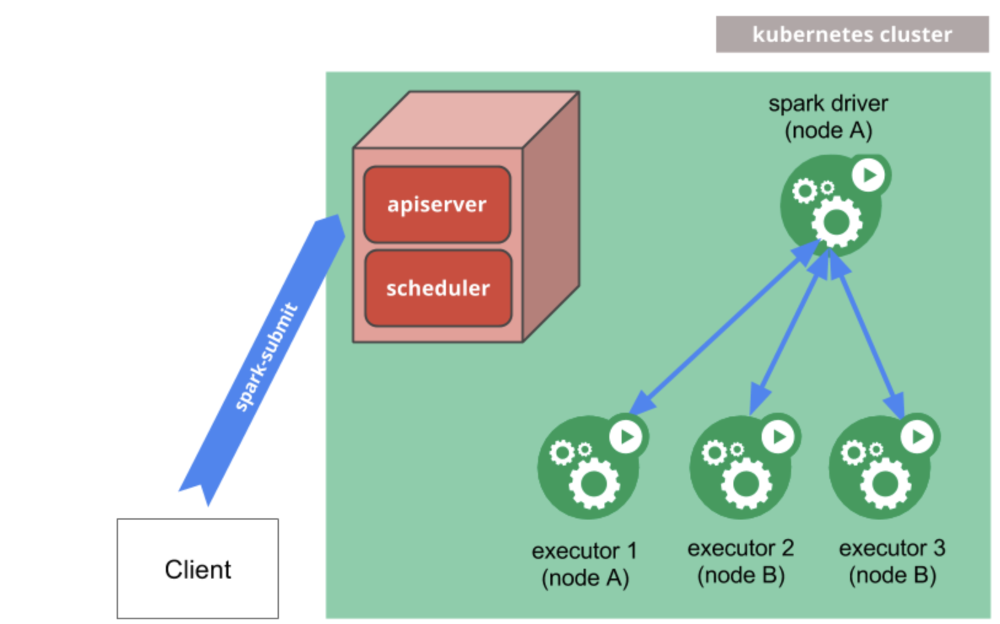
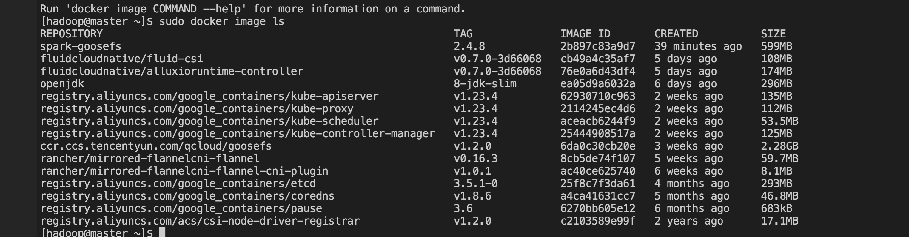
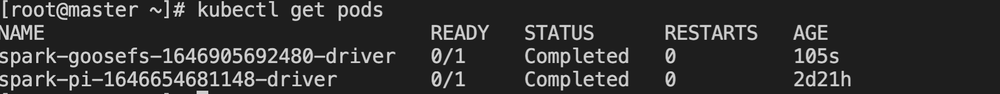
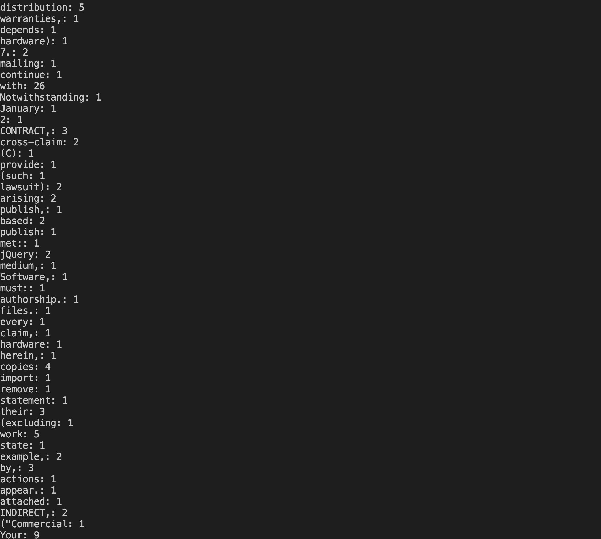

# 在 Kubernetes 中使用 GooseFS 加速 Spark 数据访问

## 概述

在 Kubernetes 上运行的 Spark 可以将 GooseFS 用作数据访问层。本文将讲解如何在 Kubernetes 环境中使用 GooseFS 加速 Spark 的数据访问。

## 实践部署

### 环境与依赖版本

- CentOS 7.4+
- Kubernetes version 1.18.0+
- Docker 20.10.0
- Spark version 2.4.8+
- GooseFS 1.2.0+

### Kubernetes 的部署

详细的 Kubernetes 的部署可参考 Kubernetes 的官方文档：https://kubernetes.io/zh/docs/setup/#production-environment

### 使用 GooseFS 加速 Spark 数据访问

目前，在 Kuberntes 中使用 GooseFS 加速 Spark 的数据访问主要有两种方式：

- 基于 [Fluid](https://github.com/fluid-cloudnative/fluid) 分布式数据编排与加速引擎（Fluid Operator 架构）部署运行 GooseFS Runtime Pods 和 Spark Runtime 加速 Spark 计算应用；
- 在 Kubernetes 中运行 Spark on GooseFS（Kubernetes Native 部署架构）。

#### 基于 Fluid 部署运行 GooseFS on Kubernetes

Fluid 是 CNCF 基金会下的一个开源 Kubernetes 原生的分布式数据集编排和加速引擎，主要服务于云原生场景下的数据密集型应用，例如大数据应用、AI应用等，详细介绍可参考：https://github.com/fluid-cloudnative/fluid。

Fluid 也在 0.6.0 版本中正式集成了 GooseFS 的 Runtime（https://github.com/fluid-cloudnative/fluid/blob/master/CHANGELOG.md），因此基于 Fluid 部署 GooseFS 加速 Spark 应用详情可参考腾讯云 GooseFS 官网文档：https://cloud.tencent.com/document/product/1424/68316，这里也推荐 Fluid-0.7.0 以上版本部署运行 GooseFS。

#### 在 Kubernetes 中运行 Spark on GooseFS

##### 前置条件

- Spark on Kubernetes 采用的是Spark官网推荐 Kubernetes Native 部署运行架构：



详细的部署运行方法可参考 Spark 的官网文档：https://spark.apache.org/docs/2.4.8/running-on-kubernetes.html。

- 已经部署好的 GooseFS 集群。GooseFS 的集群部署可参考：https://cloud.tencent.com/document/product/1424/68299。
**这里需要特别注意的是：部署 GooseFS Worker 的时候，需要配置 goosefs.worker.hostname=$(hostname -i)，否则 Spark pod 中的client 会无法解析 GooseFS 的 Worker 地址。**

##### 基本步骤

1. 首先，下载解压 [spark-2.4.8-bin-hadoop2.7.tgz](https://archive.apache.org/dist/spark/spark-2.4.8/spark-2.4.8-bin-hadoop2.7.tgz);
2. 然后，将 GooseFS client 从 GooseFS 的 Docker 镜像中解压出来然后编译到 Spark 镜像中；

```Bash
# 将 GooseFS client 从 GooseFS 的 Docker 镜像中解压出来
$ id=$(docker create goosefs/goosefs:v1.2.0)
$ docker cp $id:/opt/alluxio/client/goosefs-1.2.0-client.jar - > goosefs-1.2.0-client.jar
$ docker rm -v $id 1>/dev/null

# 然后，copy 到 spark 的目录中
$ cp goosefs-1.2.0-client.jar /path/to/spark-2.4.8-bin-hadoop2.7/jars

# 然后，重新编译 spark 的 docker 镜像
$ docker build -t spark-goosefs:2.4.8 -f kubernetes/dockerfiles/spark/Dockerfile .

# 查看编译好的 docker image
$ docker image ls
```




##### 测试步骤

首先，需要保证 GooseFS 集群已经启动运行，并且容器能够访问到 GooseFS Master/Worker 的 IP 和端口，然后按照以下步骤进行测试验证：

1.在 GooseFS 中创建一个用于测试的 namespace，例如，这里创建一个 /spark-cosntest 的namespace，并放入测试数据文件:

```shell
$ goosefs ns create spark-cosntest cosn://goosefs-test-125000000/ --secret fs.cosn.userinfo.secretId=AKIDXXXXXXXXX --secret fs.cosn.userinfo.secretKey=XXXXXXXXXX --attribute fs.cosn.bucket.region=ap-xxxx

# 放入一个测试数据文件
$ goosefs fs copyFromLocal LICENSE /spark-cosntest

```

2.然后创建一个用于运行 spark 作业的服务账号（这一步可选）:

```shell
$ kubectl create serviceaccount spark
$ kubectl create clusterrolebinding spark-role --clusterrole=edit \
  --serviceaccount=default:spark --namespace=default
```

3.然后，提交一个 spark 作业即可：

```shell
  --master k8s://http://127.0.0.1:8001 \
  --deploy-mode cluster \
  --name spark-goosefs \
  --class org.apache.spark.examples.JavaWordCount \
  --conf spark.executor.instance=2 \
  --conf spark.kubernetes.container.image=spark-goosefs/spark:2.4.8 \
  --conf spark.kubernetes.authenticate.driver.serviceAccountName=spark \
  --conf spark.hadoop.fs.gfs.impl=com.qcloud.cos.goosefs.hadoop.GooseFileSystem \
  --conf spark.driver.extraClassPath=local:///opt/spark/jars/goosefs-1.2.0-client.jar \
  local:///opt/spark/examples/jars/spark-examples_2.11-2.4.8.jar \
  gfs://172.16.64.32:9200/spark-cosntest/LICENSE
```

4. 最后，等待执行完成即可：



执行 ``` kubectl logs spark-goosefs-1646905692480-driver ``` 查看作业执行结果即可：




