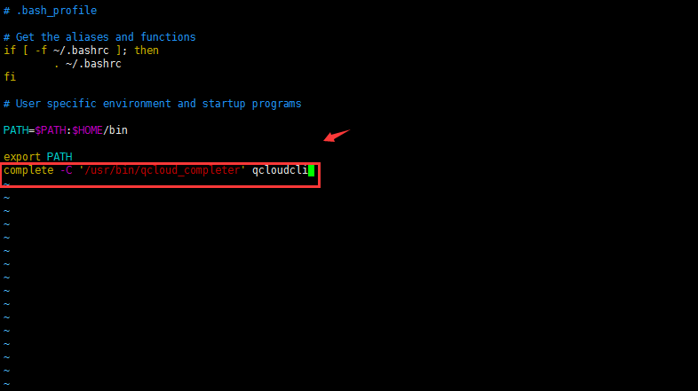

##Linux Unix MacOS环境安装
###安装python和Pip
安装命令行工具前确保您的系统已经安装了python环境和Pip工具。
[如何安装python环境和pip工具]()
###安装命令行工具	
1.通过pip安装命令行工具
```
$ sudo pip install qcloudcli
```
2.如果您已经安装有qcloudcli，请使用pip的--upgrade选项来升级到最新版本的qcloudcli
```
$ sudo pip install --upgrade qcloudcli
```
3.检验qcloudcli是否安装成功：
```
$  qcloudcli --help
NAME:
	qcloudcli
DESCRIPTION:
	The Qcloud Command Line Interface is a unified tool to manage your qcloud services.
```
###安装命令行自动补齐
1.找到自动补全脚本qcloud_completer位置,使用命令
```
$ which qcloud_completer
/usr/bin/qcloud_completer
```
2.将qcloud_completer所在路径加入系统的自动补全命令,使用命令
```
$ complete -C '/usr/bin/qcloud_completer' qcloudcli
```
3.观察是否包含qcloudcli自动补全脚本,获得类似如下结果证明已包含了qcloudcli的自动补全脚本。：
```
$ complete | grep qcloudcli
complete -C '/usr/bin/qcloud_completer' qcloudcli
```
4.使用自动补全功能
在qcloudcli中使用TAB键使用自动补全功能，如果命令唯一，则直接补全，否则展示当前所有可用命令：
```
$ qcloudcli c
cam     cbs     cdb     cdn     cmem    cns     configure   cvm   
```
5.自动补全命令自动有效
为了保证每次启动自动补全命令均有效，您需要将自动补全的命令写入配置文件~/.bash_profile中:
使用命令
```
$ vim ~/.bash_profile
```
追加到文件末尾即可：



