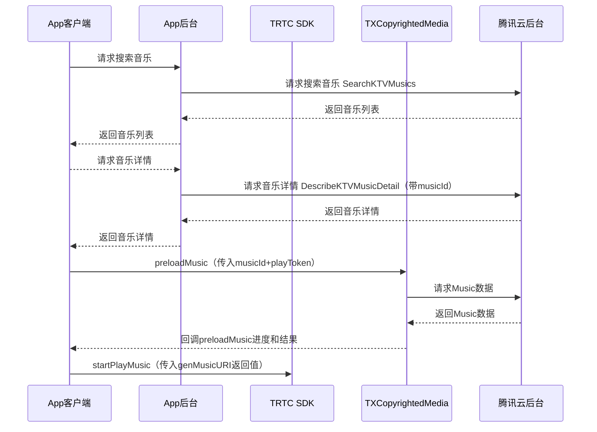

## 产品概述

正版曲库直通车（Authorized Music Express，AME）聚合TME等多家版权方优质曲目资源，结合腾讯云存储、编解码、内容分发、边缘计算等能力，有效解决多场景音乐素材应用版权问题。提供API及SDK，灵活高效实现正版音乐素材在多端的顺畅播放与应用。

游戏多媒体引擎（Game Multimedia Engine, GME）提供一站式语音解决方案。针对游戏场景，提供实时语音、语音消息、语音转文本、语音内容安全、未成年人识别、正版曲库、语音录制等服务，覆盖 FPS、MOBA、MMORPG、休闲对战、棋牌、线上桌游等多种游戏玩法类型；支持移动游戏、端游、主机游戏、网页游戏跨平台互通，一次接入即可满足多样化的语音需求。

## 产品原理


## 接入前准备工作

### 步骤1：账号注册及认证

- 注册 [腾讯云账号](https://cloud.tencent.com/register?s_url=https%3A%2F%2Fcloud.tencent.com%2F)。
- 完成 [实名认证](https://cloud.tencent.com/document/product/378/3629)。

### 步骤2：服务开通
- **正版曲库直通车 AME 服务开通**：登录 [正版曲库直通车 AME 控制台](https://console.cloud.tencent.com/ame) 后，您可在勾选同意 [腾讯云服务协议](https://cloud.tencent.com/document/product/301/1967) 以及 [正版曲库直通车服务协议](https://cloud.tencent.com/document/product/1155/40757) 后单击**立即开通**，即可开通服务。
- **游戏多媒体引擎 GME 服务开通**：登录 [游戏多媒体引擎 GME 控制台](https://console.cloud.tencent.com/gamegme) 开通并使用产品。

### 步骤3：应用创建
您可在左导航栏进入**正版曲库直通车控制台** > [**应用管理**](https://console.cloud.tencent.com/ame/app) 页面，单击**创建应用**，根据弹窗填空提示，填写相应的信息：

| 配置项 | 配置说明 | 
|---------|---------| 
| 应用名称 | 指接入 App 应用名称。应用名称涉及版权授权，请准确填写，创建后无法再次修改。 | 
| Android PackageName | 指接入应用在 Android 应用市场的 PackageName。请准确填写，创建后无法再次修改。 | 
|  IOS BundleID | 指接入应用在 iOS 应用市场的 BundleID，请准确填写，创建后无法再次修改。 | 
| 应用场景 | 请根据接入应用的具体使用场景如实选择（语聊房/直播/FM）。 | 
| DAU | 请基于接入应用实际情况准确填写。 | 


### 步骤4：白名单添加
因产品尚在内测，在正式接入之前，请联系对应商务经理或 [联系我们](https://cloud.tencent.com/act/event/connect-service?from=intro_ame#/) 为您添加白名单。您也可加入产品官方 QQ 群：**547084042**，获取产品一手资讯，在线答疑。

### 步骤5：API 联调
<dx-tabs>
::: 搜索选曲
-  调用 [搜索直播互动曲库歌曲](https://cloud.tencent.com/document/product/1155/56401) 接口，根据搜索条件返回匹配的歌曲列表。
- 调用 [查询直播互动曲目详情](https://cloud.tencent.com/document/product/1155/56402) 接口，查询歌曲的详细信息。
:::
::: 推荐歌单
- 调用 [获取直播互动曲库推荐歌单列表](https://cloud.tencent.com/document/product/1155/60295) 接口，获取推荐歌单 ID 及歌单基础信息。
- 调用 [获取直播互动曲库推荐歌单详情](https://cloud.tencent.com/document/product/1155/60296) 接口，获取歌曲 ID 及歌曲基础信息。
- 调用 [查询直播互动曲目详情](https://cloud.tencent.com/document/product/1155/56402) 接口，获取 SDK 播放所需 PlayToken。

>?PlayToken 与歌词获取链接，有效期均为1个小时，过期需重新获取。另外您也可以：
>- 通过 [API 3.0 Explorer](https://console.cloud.tencent.com/api/explorer) 进行在线调用、签名验证、SDK 代码生成和快速检索接口等能力。
>- 通过 [腾讯云命令行工具](https://cloud.tencent.com/document/product/440/6176) 来调用腾讯云 API，管理您的腾讯云资源，基于腾讯云 CLI 来做自动化和脚本处理，从而简化部分复杂 API 的服务。
:::
</dx-tabs>


## SDK 接入
### SDK 下载

| SDK 类型 | 下载地址 | 
|---------|---------|
| AME SDK 1.0.5 | [下载](https://mediacloud-76607.gzc.vod.tencent-cloud.com/TXCopyrightedMedia/Release/1.0.5/TXCopyrightedMedia-Android-1.0.5.220111.zip) | 
| GME SDK | [下载](https://cloud.tencent.com/document/product/607/18521) | 


### SDK 集成
1. 集成版权曲库 SDK（拷贝 `TXCopyrightedMedia.framework`）到项目工程中并集成。
2. 如果使用 pod 导入，则在 podfile 里面添加：
```
pod 'TXCopyrightedMedia'
```
3. [集成 GME SDK](https://cloud.tencent.com/document/product/607/56374) 。

### SDK 使用说明

- **获取 TXCopyrightedMedia 单例**
```
TXCopyrightedMedia copyrightedMedia = TXCopyrightedMedia.instance();
```
- **设置 License**
```
copyrightedMedia.setLicense(Context context, String licenseUrl, String key);
```
参数说明：
<table>
<thead><tr><th>参数名</th><th>类型</th><th>描述</th></tr>
</thead>
<tbody><tr>
<td>context</td>
<td>Context</td>
<td>Context 上下文</td>
</tr><tr>
<td>licenseUrl</td>
<td>String</td>
<td>控制台生成的 License URI</td>
</tr><tr>
<td>key</td>
<td>String</td>
<td>控制台生成的 key</td>
</tr></tbody></table>
-  **初始化 TXCopyrightedMedia**
```
copyrightedMedia.init();
```
- **销毁 TXCopyrightedMedia**
当程序退出后调用销毁。
```
copyrightedMedia.destroy();
```
- **预加载 Music 数据**
每次播放/重播前都需要调用该接口。
```
copyrightedMedia.preloadMusic(String musicId, String bitrateDefinition, String playToken, ITXMusicPreloadCallback callback);
```
参数说明：
<table>
<thead><tr><th>参数名</th><th>类型</th><th>描述</th></tr>
</thead>
<tbody><tr>
<td>musicId</td>
<td>String</td>
<td>歌曲 ID</td>
</tr><tr>
<td>bitrateDefinition</td>
<td>String</td>
<td>码率描述（audio/mi：64，audio/lo：128，audio/hi：320）</td>
</tr><tr>
<td>playToken</td>
<td>String</td>
<td>播放 Token</td>
</tr><tr>
<td>callback</td>
<td>ITXMusicPreloadCallback</td>
<td>回调函数</td>
</tr></tbody></table>
```
interface ITXMusicPreloadCallback {
    void onPreloadStart(String musicId, String bitrateDefinition);
    void onPreloadProgress(String musicId, String bitrateDefinition, float progress);
    void onPreloadComplete(String musicId, String bitrateDefinition, int errCode, String errMsg);
}
```
errCode 返回错误码定义如下：
<table>
<thead><tr><th>定义</th><th>数值</th><th>描述</th></tr></thead>
<tbody><tr>
<td>ERR_NONE</td><td>0</td><td>无错误</td>
</tr><tr>
<td>ERR_INIT_FAIL</td><td>-1</td><td>初始化失败</td>
</tr><tr>
<td>ERR_CANCEL</td><td>-2</td><td>用户取消数据获取</td>
</tr><tr>
<td>ERR_TOKEN_FAIL</td><td>-3</td><td>Token 过期</td>
</tr><tr>
<td>ERR_NET_FAIL</td><td>-4</td><td>网络错误</td>
</tr><tr>
<td>ERR_INNER</td><td>-5</td><td>内部错误</td>
</tr><tr>
<td>ERR_PARSE_FAIL</td><td>-6</td><td>解析错误</td>
</tr><tr>
<td>ERR_DECRYPT_FAIL</td><td>-7</td><td>解密错误</td>
</tr><tr>
<td>ERR_LICENCE_FAIL</td><td>-8</td><td>License 校验不通过</td>
</tr>
</tbody></table>
- **取消预加载 Music 数据**
```
copyrightedMedia.cancelPreloadMusic(String musicId, String bitrateDefinition);
```
参数说明：
<table>
<thead><tr><th>参数名</th><th>类型</th><th>描述</th></tr></thead>
<tbody><tr>
<td>musicId</td>
<td>String</td>
<td>歌曲 ID</td>
</tr><tr>
<td>bitrateDefinition</td>
<td>String</td>
<td>码率描述（ audio/mi：64，audio/lo：128，audio/hi：320）</td>
</tr></tbody></table>
- **检测是否已预加载 Music 数据**
```
boolean isPreloaded = copyrightedMedia.isMusicPreloaded(String musicId);
```
参数说明：
<table>
<thead><tr><th>参数名</th><th>类型</th><th>描述</th></tr></thead>
<tbody><tr>
<td>musicId</td>
<td>String</td>
<td>音乐 ID</td>
</tr><tr>
<td>bitrateDefinition</td>
<td>String</td>
<td>码率描述（ audio/mi：64，audio/lo：128，audio/hi：320）</td>
</tr></tbody></table>
- **生成 Music URI**
App 客户端在 preloadMusic 成功之后调用，原唱&伴奏传给 TRTC 进行播放。
```
String MusicUri = TXCopyrightedMedia.genMusicURI(String musicId，int musicType);
```
参数说明：
<table>
<thead><tr><th>参数名</th><th>类型</th><th>描述</th></tr></thead>
<tbody><tr>
<td>musicId</td>
<td>String</td>
<td>歌曲 ID</td>
</tr><tr>
<td>musicType</td>
<td>Int</td>
<td>0：原唱，1：伴奏，2：歌词</td>
</tr><tr>
<td>bitrateDefinition</td>
<td>String</td>
<td>码率描述（ audio/mi：64，audio/lo：128，audio/hi：320）</td>
</tr>
</tbody></table>
返回说明：
<table>
<thead><tr><th>返回值</th><th>类型</th><th>描述</th></tr></thead>
<tbody><tr>
<td>musicUri</td>
<td>String</td>
<td><ul style="margin:0"><li>原唱&amp;伴奏：传给 TRTC 播放的 URI，格式 <code>CopyRightMusic://audiotype=xxxx&amp;musicid=xxxx</code></li><li>歌词：返回歌词的本地路径</li></ul></td>
</tr></tbody></table>
- **清理歌曲缓存**
清理本地所有缓存歌曲数据。
```
copyrightedMedia.clearMusicCache();
```
- **设置缓存歌曲最大数量**
```
copyrightedMedia.setMusicCacheMaxCount(int maxCount);
```
参数说明：
<table>
<thead><tr><th>参数名</th><th>类型</th><th>描述</th></tr></thead>
<tbody><tr>
<td>maxCount</td>
<td>Int</td>
<td>歌曲最大缓存数量，默认50</td>
</tr></tbody></table>


### 代码示例
- application 创建时候调用：
```
TXCopyrightedMedia.instance().setLicense(context, licenseUrl, key);
```
- 进入主界面时候调用：
```
TXCopyrightedMedia.instance().init();
```
- 退出主界面时候调用：
```
TXCopyrightedMedia.instance().destroy();
```
- 进入 K 歌房间，单击 **K 歌**,下载 Music：
```
TXCopyrightedMedia copyRightedMedia = TXCopyrightedMedia.instance();
if(copyRightedMedia.isMusicPreloaded(musicId, bitrateDefinition){
     startPlayMusic();
}else{
  ITXMusicPreloadCallback callback = new ITXMusicPreloadCallback() {
      @override
      public void onPreloadStart(String musicId, String bitrateDefinition) {
        // 界面提示 Music 开始加载
      }
      @override
      public void onPreloadProgress(String musicId, String bitrateDefinition, float progress){
        // 界面显示进度
      }
      @override
      void onPreloadComplete(String musicId, String bitrateDefinition, int errorCode, String errMsg){
        // 缓存完毕
        if(errorCode == ErrorCode.Success) {
          startPlayMusic();
        } else {
          // 提示失败，详情见ErrorCode
        } 
      }
  }
  copyRightedMedia.preloadMusic(musicId, playToken, callback);
}

void startPlayMusic(){
    String origintUri = TXCopyrightedMedia.genMusicURI(musicId, 0);//获取原唱 uri
    String accompUri = TXCopyrightedMedia.genMusicURI(musicId, 1);//获取伴奏 uri
android:
ITMGContext.GetInstance(getActivity()).GetAudioEffectCtrl().StartAccompany(origintUri, true, 1);
}
```


