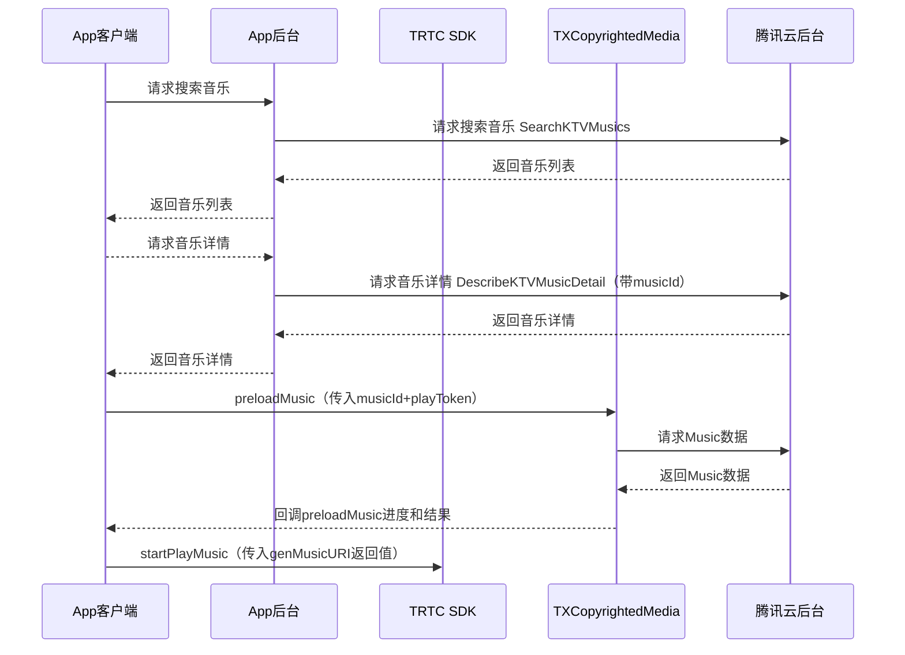

## 产品概述
实时音视频 TRTC & 版权曲库 AME 在线 KTV 联合解决方案深度整合腾讯在音视频深度积累的技术能力以及音乐内容版权上的核心优势产生1+1大于2的化学反应，帮助开发者极速搭建在线KTV业务。

- **实时音视频 TRTC** 提供全球端到端平均延时 &lt; 300 ms实时连麦以及10万人 &lt; 1s的超低延时观看的技术方案。
同时面向在线KTV场景提供48kHz采样率，128kbps立体声音频、低延时耳返让线上拥有媲美线下的KTV体验；更有变声、气氛音效、混响等多种趣味玩法。
- **正版曲库直通车**聚合 TME 等多家版权方优质曲目资源，结合腾讯云存储、编解码、内容分发、边缘计算等能力，有效解决多场景音乐素材应用版权问题。您可在控制台选购单曲/曲库包，提供下载/API/SDK 多种接入方式，灵活高效实现正版音乐素材在多端的顺畅播放与应用。

## 产品原理

## 接入前准备工作

### 步骤1：账号注册及认证
- 注册 [腾讯云账号](https://cloud.tencent.com/register?s_url=https%3A%2F%2Fcloud.tencent.com%2F)。
- 完成 [实名认证](https://cloud.tencent.com/document/product/378/3629)。


### 步骤2：服务开通
- **正版曲库直通车 AME 服务开通**：登录 [正版曲库直通车 AME 控制台](https://console.cloud.tencent.com/ame) 后，您可在勾选同意 [腾讯云服务协议](https://cloud.tencent.com/document/product/301/1967) 以及 [正版曲库直通车服务协议](https://cloud.tencent.com/document/product/1155/40757) 后单击**立即开通**，即可开通服务。
- **实时音视频 TRTC 服务开通**：登录 [实时音视频 TRTC 控制台](https://console.cloud.tencent.com/trtc) 开通并使用产品。

### 步骤3：应用创建
您可在左导航栏进入**正版曲库直通车控制台** > [**应用管理**](https://console.cloud.tencent.com/ame/app) 页面，单击**创建应用**，根据弹窗填空提示，填写相应的信息：

| 配置项 | 配置说明 | 
|---------|---------| 
| 应用名称 | 指接入 App 应用名称。应用名称涉及版权授权，请准确填写，创建后无法再次修改。 | 
| Android PackageName | 指接入应用在 Android 应用市场的 PackageName。请准确填写，创建后无法再次修改。 | 
|  IOS BundleID | 指接入应用在 iOS 应用市场的 BundleID，请准确填写，创建后无法再次修改。 | 
| 应用场景 | 请根据接入应用的具体使用场景如实选择（语聊房/直播/FM）。 | 
| DAU | 请基于接入应用实际情况准确填写。 | 


### 步骤4：白名单添加
因产品尚在内测，在正式接入之前，请联系对应商务经理为您添加白名单。

### 步骤5：API 联调

| API名称     | 描述   | 使用说明                   |
| ---------- | ------ | ---------------------- |
| SearchKTVMusics | 搜索 KTV 曲库 |  [文档地址](https://cloud.tencent.com/document/product/1155/56401) |
| DescribeKTVMusicDetail | 查询曲库歌曲详情 | [文档地址](https://cloud.tencent.com/document/product/1155/56402) |

1. 首先调用 SearchKTVMusics 搜索目标歌曲，返回的列表包含歌曲的信息及 ID：
```java
// 请求
POST / HTTP/1.1
Host: ame.tencentcloudapi.com
Content-Type: application/json
X-TC-Action: SearchKTVMusics
<公共请求参数>

{
    "Limit": 10,
    "KeyWord": "歌手名称",
    "Offset": 0
}

// 响应
{
  "Response": {
    "TotalCount": 1,
    "KTVMusicInfoSet": [
      {
        "ComposerSet": [
          "作词人"
        ],
        "MusicId": "ame-78dxxx",
        "SingerSet": [
          "歌手名称"
        ],
        "Name": "歌名",
        "LyricistSet": [
          "歌手名称"
        ],
        "TagSet": [
          "华语",
          "流行"
        ]
      }
    ],
    "RequestId": "xx"
  }
}
```
2. 根据上面接口返回的 ID 查询歌曲详情，包含 SDK 中所需要的 PlayToken：
```java
// 请求
POST / HTTP/1.1
Host: ame.tencentcloudapi.com
Content-Type: application/json
X-TC-Action: DescribeKTVMusicDetail
<公共请求参数>

{
    "MusicId": "ame-78d2xxx"
}

// 响应
{
  "Response": {
    "PlayToken": "DUE3344xxxxxx",
    "KTVMusicBaseInfo": {
      "ComposerSet": [
        "歌手名称"
      ],
      "MusicId": "ame-78d2xxx",
      "SingerSet": [
        "歌手名称"
      ],
      "Name": "歌名",
      "LyricistSet": [
        "作词人"
      ],
      "TagSet": [
        "华语",
        "流行"
      ]
    },
    "RequestId": "xx"
  }
}
```


## SDK接入
### 集成 SDK
1. 拷贝 `TXCopyRightedMedia-Android-1.0.4.aar` 到 libs 目录，添加依赖项：
```
implementation(name:'TXCopyRightedMedia-Android-1.0.4', ext:'aar')
```
2. [集成 TRTC SDK](https://cloud.tencent.com/document/product/647/32175)。
```
implementation 'com.tencent.liteav:LiteAVSDK_TRTC:latest.release
```
注意混淆：
```
-keep class com.tencent. { *; }
```

### SDK 使用 说明
- **获取 TXCopyrightedMedia 单例**
```java
TXCopyrightedMedia copyrightedMedia = TXCopyrightedMedia.instance();
```
- **设置 License**
```java
copyrightedMedia.setLicense(Context context, String licenseUrl, String key);
```
参数说明：
<table>
<thead>
<tr>
<th>参数名</th>
<th>类型</th>
<th>描述</th>
</tr>
</thead>
<tbody><tr>
<td>context</td>
<td>Context</td>
<td>Context 上下文</td>
</tr>
<tr>
<td>licenseUrl</td>
<td>String</td>
<td>控制台生成的 LicenseURL</td>
</tr>
<tr>
<td>key</td>
<td>String</td>
<td>控制台生成的 key</td>
</tr>
</tbody></table>
- **初始化 TXCopyrightedMedia**
```java
copyrightedMedia.init();
```
- **销毁TXCopyrightedMedia**
当程序退出后调用销毁。
```java
copyrightedMedia.destroy();
```
- **预加载 Music 数据**
每次播放/重播前都需要调用该接口。
```java
copyrightedMedia.preloadMusic(String musicId, String bitrateDefinition, String playToken, ITXMusicPreloadCallback callback);
```
参数说明：
<table>
<thead>
<tr>
<th>参数名</th>
<th>类型</th>
<th>描述</th>
</tr>
</thead>
<tbody><tr>
<td>musicId</td>
<td>String</td>
<td>歌曲 ID</td>
</tr>
<tr>
<td>bitrateDefinition</td>
<td>String</td>
<td>码率描述（audio/mi：64，audio/lo：128，audio/hi：320）</td>
</tr>
<tr>
<td>playToken</td>
<td>String</td>
<td>播放Token</td>
</tr>
<tr>
<td>callback</td>
<td>ITXMusicPreloadCallback</td>
<td>回调函数</td>
</tr>
</tbody></table>
```java
interface ITXMusicPreloadCallback {
    void onPreloadStart(String musicId, String bitrateDefinition);
    void onPreloadProgress(String musicId, String bitrateDefinition, float progress);
    void onPreloadComplete(String musicId, String bitrateDefinition, int errCode, String errMsg);
}
```
errCode 返回错误码定义如下：
<table>
<thead>
<tr>
<th>定义</th>
<th>数值</th>
<th>描述</th>
</tr>
</thead>
<tbody><tr>
<td>ERR_NONE</td>
<td>0</td>
<td>无错误</td>
</tr>
<tr>
<td>ERR_INIT_FAIL</td>
<td>-1</td>
<td>初始化失败</td>
</tr>
<tr>
<td>ERR_CANCEL</td>
<td>-2</td>
<td>用户取消数据获取</td>
</tr>
<tr>
<td>ERR_TOKEN_FAIL</td>
<td>-3</td>
<td>token 过期</td>
</tr>
<tr>
<td>ERR_NET_FAIL</td>
<td>-4</td>
<td>网络错误</td>
</tr>
<tr>
<td>ERR_INNER</td>
<td>-5</td>
<td>内部错误</td>
</tr>
<tr>
<td>ERR_PARSE_FAIL</td>
<td>-6</td>
<td>解析错误</td>
</tr>
<tr>
<td>ERR_DECRYPT_FAIL</td>
<td>-7</td>
<td>解密错误</td>
</tr>
<tr>
<td>ERR_LICENCE_FAIL</td>
<td>-8</td>
<td>License 校验不通过</td>
</tr>
</tbody></table>
- **取消预加载 Music 数据**
```java
copyrightedMedia.cancelPreloadMusic(String musicId, String bitrateDefinition);
```
参数说明：
<table>
<thead>
<tr>
<th>参数名</th>
<th>类型</th>
<th>描述</th>
</tr>
</thead>
<tbody><tr>
<td>musicId</td>
<td>String</td>
<td>歌曲 ID</td>
</tr>
<tr>
<td>bitrateDefinition</td>
<td>String</td>
<td>码率描述（audio/mi：64，audio/lo：128，audio/hi：320）</td>
</tr>
</tbody></table>
- **检测是否已预加载 Music 数据**
```java
boolean isPreloaded = copyrightedMedia.isMusicPreloaded(String musicId, String bitrateDefinition);
```
参数说明：
<table>
<thead>
<tr>
<th>参数名</th>
<th>类型</th>
<th>描述</th>
</tr>
</thead>
<tbody><tr>
<td>musicId</td>
<td>String</td>
<td>音乐 ID</td>
</tr>
<tr>
<td>bitrateDefinition</td>
<td>String</td>
<td>码率描述（audio/mi：64，audio/lo：128，audio/hi：320）</td>
</tr>
</tbody></table>
- **生成 Music URI**
App 客户端在 preloadMusic 成功之后调用，原唱&伴奏传给 TRTC 进行播放。
```java
String MusicUri = TXCopyrightedMedia.genMusicURI(String musicId，int musicType, String bitrateDefinition);
```
参数说明：
<table>
<thead>
<tr>
<th>参数名</th>
<th>类型</th>
<th>描述</th>
</tr>
</thead>
<tbody><tr>
<td>musicId</td>
<td>String</td>
<td>歌曲 ID</td>
</tr>
<tr>
<td>musicType</td>
<td>Int</td>
<td>0：原唱，1：伴奏, 2：歌词</td>
</tr>
<tr>
<td>bitrateDefinition</td>
<td>String</td>
<td>码率描述（audio/mi：64，audio/lo：128，audio/hi：320）</td>
</tr>
</tbody></table>
返回说明：
<table>
<thead>
<tr>
<th>返回值</th>
<th>类型</th>
<th>描述</th>
</tr>
</thead>
<tbody><tr>
<td>musicUri</td>
<td>String</td>
<td><ul><li>原唱&伴奏：传给 TRTC 播放的 URL，格式 <code>CopyRightMusic://audiotype=xxxx&amp;musicid=xxxx&amp;bitrate=xxxx；</code></li><li>歌词：返回歌词的本地路径</li></ul></td>
</tr>
</tbody></table>
- **清理歌曲缓存**
```java
copyrightedMedia.clearMusicCache();
```
- **设置缓存歌曲最大数量**
```java
copyrightedMedia.setMusicCacheMaxCount(int maxCount);
```
参数说明：
<table>
<thead>
<tr>
<th>参数名</th>
<th>类型</th>
<th>描述</th>
</tr>
</thead>
<tbody><tr>
<td>maxCount</td>
<td>Int</td>
<td>歌曲最大缓存数量，默认50</td>
</tr>
</tbody></table>

## 代码示例
- application 创建时候调用:
```java
TXCopyrightedMedia.instance().setLicense(context, licenseUrl, key);
```
- 进入主界面时候调用：
```java
TXCopyrightedMedia.instance().init();
```
- 退出主界面时候调用：
```java
TXCopyrightedMedia.instance().destroy();
```
- 进入 K 歌房间，单击 **K 歌**，下载 Music：
```java
TXCopyrightedMedia copyRightedMedia = TXCopyrightedMedia.instance();
if(copyRightedMedia.isMusicPreloaded(musicId, bitrateDefinition)){
     startPlayMusic();
}else{
  ITXMusicPreloadCallback callback = new ITXMusicPreloadCallback() {
      @override
      public void onPreloadStart(String musicId, String bitrateDefinition) {
        // 界面提示 Music 开始加载
      }
      @override
      public void onPreloadProgress(String musicId, String bitrateDefinition, float progress){
        // 界面显示进度
      }
      @override
      void onPreloadComplete(String musicId, String bitrateDefinition, int errorCode, String errMsg){
        // 缓存完毕
        if(errorCode == ErrorCode.Success) {
          startPlayMusic();
        } else {
          // 提示失败，详情见ErrorCode
        } 
      }
  }
  copyRightedMedia.preloadMusic(musicId, playToken, callback);
}

void startPlayMusic(){
    String origintUri = TXCopyrightedMedia.genMusicURI(musicId, 0, "audio/lo");//获取原唱 uri
    String accompUri = TXCopyrightedMedia.genMusicURI(musicId, 1, "audio/lo");//获取伴奏 uri
    // 注意，上面的 musicId 是曲库后台接口返回的字符串，用来区分存储在后台的音乐资源
    //      下面的 originMusicId 和 accompMusicId 是 int 型格式，您可以自己设置，
    //      用于 TRTC 的 BGM 播放接口区分不同的音乐使用，保证原唱和伴奏的 id 不同即可
    int originMusicId = 0;//原唱的 music id
    int accompMusicId = 1;//伴唱的 music id
    TXAudioEffectManager.AudioMusicParam originMusicParam = 
      new TXAudioEffectManager.AudioMusicParam(originMusicId, origintUri);
    TXAudioEffectManager.AudioMusicParam accompMusicParam = 
      new TXAudioEffectManager.AudioMusicParam(accompMusicId, accompUri);
    // 播放原唱和伴奏
    TRTCCloud.sharedInstance(this).startPlayMusic(originMusicParam);
    TRTCCloud.sharedInstance(this).startPlayMusic(accompMusicParam);
  
    //调用以下代码会播放并上行伴奏：
    TXAudioEffectManager.setMusicPlayoutVolume(originMusicId,0);
    TXAudioEffectManager.setMusicPlayoutVolume(accompMusicId,100);
    TXAudioEffectManager.setMusicPublishVolume(originMusicId,0);
    TXAudioEffectManager.setMusicPublishVolume(accompMusicId,100);

    //调用以下代码会播放并上行原唱：
    TXAudioEffectManager.setMusicPlayoutVolume(originMusicId,100);
    TXAudioEffectManager.setMusicPlayoutVolume(accompMusicId,0);
    TXAudioEffectManager.setMusicPublishVolume(originMusicId,100);
    TXAudioEffectManager.setMusicPublishVolume(accompMusicId,0);
}
```
