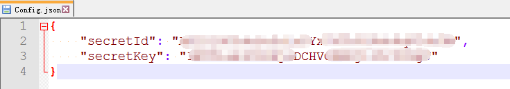
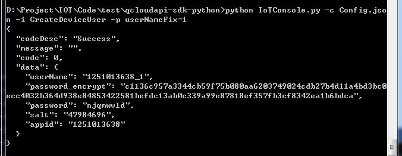
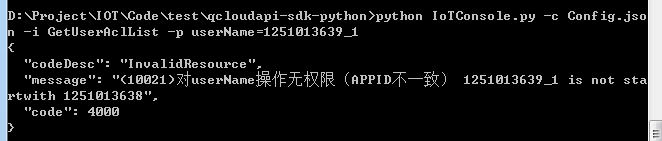

# 使用示例
为了帮助您快速上手使用物联云Hub API,这里给出[IoTConsole工具](https://mc.qcloudimg.com/static/archive/e5f12635efac664beac5b2461e940d97/IoTConsole_API-1.0.0.zip)，并提供使用示例。

## 1. 基本功能
本工具适用于IoT项目，提供API访问的简易命令行操作。

## 2. 运行环境
-  Windows/Linux
-  Python 2.x

## 3.使用说明
- 运行：python iotconsole.py
(linux亦可./iotconsole.py)

- 参数：

指令 | 描述
---|---
-h, --help | 帮助
-v, --version | 版本信息
-c, --configFile | 配置文件路径（以JSON格式输入其他参数）
-d, --secretId | 用户密钥secretId
-k, --secretKey | 用户密钥secretKey
-i, --interface | 访问接口名
-p, --params | 请求参数（k1=v1&k2=v2形式），多字段需用引号

- 注意

secretId，secretKey，interface，params等也可以在configFile中输入，但是显示参数指定优先级更高。参考用法：secretId，secretKey不变且输入不方便，可以放在配置文件中。

- 必选项：secretId，secretKey，interface（可在config中）

- 帮助：python iotconsole.py –h

## 4.使用示例
### 1）创建设备账户
创建一个设备账户，userNameFix为1

**输入**： python iotconsole.py -c Config.json -i CreateDeviceUser -p userNameFix=1

**配置文件**（密钥）：

**返回结果**：

可以看到设备账户创建成功。用户名是1251013638_1，其中1251013638是你的AppID，密码是njqmwv1d。

### 2）查询账户ACL列表
**输入**：python iotconsole.py -c Config.json -i GetUserAclList -p userName=1251013639_1

**配置文件**（密钥）：

**返回结果**：

10021错误，对userName的操作无权限（每一个用户只能操作自己控制的设备账户，以本人AppID前缀开头）

## 5.错误码
### 1）公共错误码
详见腾讯云API[公共错误码](https://www.qcloud.com/document/product/213/6982)。

### 2）模块错误码
message字段表示与模块相关的错误。
其示例如下：

它由两部分组成，()内的为模块错误代码，()后的为具体的错误描述。
不同模块可能产生的错误情况是不一样的，用户可以根据具体的错误描述确定错误所在。

错误码 | 说明
---|---
10010 | userNameFix已使用
10020 | password不符合规范
10021 | userName无权限（APPID不一致）
10022 | userName不存在
10031 | clientId无权限
10032 | clientId不存在
20011 | access 不符合规范
20012 | topic不符合规范
20013 | 添加失败（重复ACL）
20014 | 删除失败（无相应ACL）
20015 | 添加失败（ACL数量超过限制）

