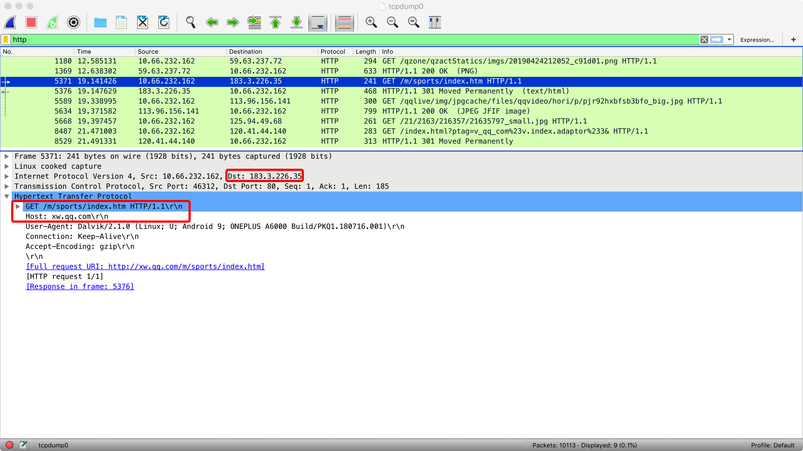
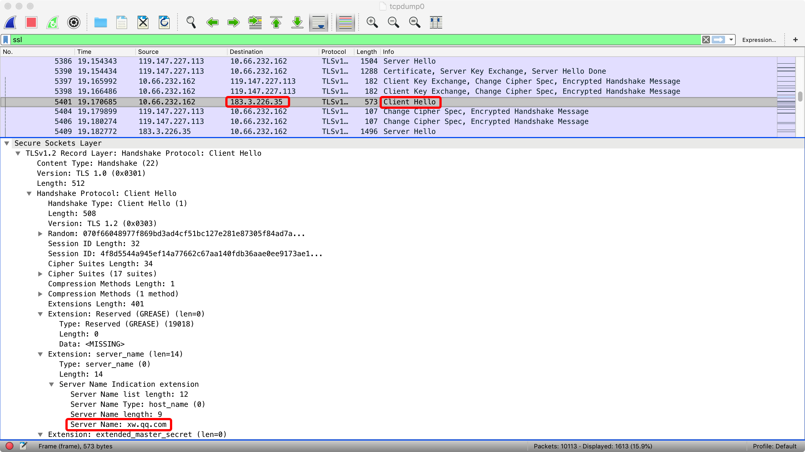

## 概述

总的来说，HTTPDNS 作为移动互联网时代 DNS 优化的一个通用解决方案，主要解决了以下几类问题：
- LocalDNS 劫持/故障
- LocalDNS 调度不准确

HTTPDNS 的 Android SDK，主要提供了基于 HTTPDNS 服务的域名解析和缓存管理能力：
- SDK 在进行域名解析时，优先通过 HTTPDNS 服务得到域名解析结果，极端情况下如果 HTTPDNS 服务不可用，则使用LocalDNS 解析结果。
- HTTPDNS 服务返回的域名解析结果会携带相关的 TTL 信息，SDK 会使用该信息进行 HTTPDNS 解析结果的缓存管理。

HTTPDNS 服务的详细介绍可以参见文章 [全局精确流量调度新思路-HTTPDNS 服务详解](https://cloud.tencent.com/developer/article/1035562)。
智营解析 Android SDK 的获取方式：[点此获取](https://github.com/tencentyun/httpdns-android-sdk)

## 接入

### 权限配置

```xml
<uses-permission android:name="android.permission.ACCESS_NETWORK_STATE" />
<uses-permission android:name="android.permission.ACCESS_WIFI_STATE" />
<uses-permission android:name="android.permission.INTERNET" />

<!-- 用于获取手机imei码进行数据上报，非必须 -->
<uses-permission android:name="android.permission.READ_PHONE_STATE" />

<!-- 灯塔 -->
<uses-permission android:name="android.permission.WRITE_EXTERNAL_STORAGE" />
```

### 网络安全配置兼容

App targetSdkVersion >= 28(Android 9.0)情况下，系统默认不允许 HTTP 网络请求，详细信息参见 [Opt out of cleartext traffic](https://developer.android.com/training/articles/security-config#Opt%20out%20of%20cleartext%20traffic)。
这种情况下，业务侧需要将 HTTPDNS 请求使用的 IP 配置到域名白名单中：
- AndroidManifest 文件中配置
```xml
<?xml version="1.0" encoding="utf-8"?>
<manifest ... >
    <application android:networkSecurityConfig="@xml/network_security_config"
                    ... >
        ...
    </application>
</manifest>
```
- XML 目录下添加 network_security_config.xml 配置文件
```xml
<?xml version="1.0" encoding="utf-8"?>
<network-security-config>
    <domain-config cleartextTrafficPermitted="true">
        <domain includeSubdomains="false">119.29.29.99</domain>
    </domain-config>
</network-security-config>
```

### 接入 HTTPDNS
将 HttpDNSLibs\HTTPDNS_ANDROID_SDK_xxxx.aar 拷贝至应用 libs 相应位置。

### 接入灯塔

将 HttpDNSLibs\beacon_android_xxxx.jar 拷贝至应用 libs 相应位置。
 >! 
 >- 若您已经接入了腾讯灯塔（beacon）组件的应用，请忽略此步骤。
 >- 灯塔（beacon）SDK 是由腾讯灯塔团队开发，用于移动应用统计分析，HTTPDNS SDK 使用灯塔（beacon）SDK 收集域名解析质量数据，辅助定位问题。

### 接口调用

```Java

// 初始化灯塔：如果已经接入MSDK或者IMSDK或者单独接入了腾讯灯塔(Beacon)则不需再初始化该接口
try {
    // 注意：这里业务需要输入自己的灯塔appkey
    UserAction.setAppKey("0I000LT6GW1YGCP7");
    UserAction.initUserAction(MainActivity.this.getApplicationContext());
} catch (Exception e) {
    Log.e(TAG, "Init beacon failed", e);
}

// 以下鉴权信息可在腾讯云控制台（https://console.cloud.tencent.com/httpdns/configure）开通服务后获取

/**
 * 初始化HTTPDNS（默认为DES加密）：如果接入了MSDK，建议初始化MSDK后再初始化HTTPDNS
 *
 * @param context 应用上下文，最好传入ApplicationContext
 * @param appkey 业务appkey，即SDK AppID，腾讯云官网（https://console.cloud.tencent.com/httpdns）申请获得，用于上报
 * @param dnsid dns解析id，即授权id，腾讯云官网（https://console.cloud.tencent.com/httpdns）申请获得，用于域名解析鉴权
 * @param dnskey dns解析key，即授权id对应的key(加密密钥)，在申请SDK后的邮箱里，腾讯云官网（https://console.cloud.tencent.com/httpdns）申请获得，用于域名解析鉴权
 * @param dnsIp 由外部传入的dnsIp，如"119.29.29.99"，从<a href="https://cloud.tencent.com/document/product/379/17655"></a> 文档提供的IP为准
 * @param debug 是否开启debug日志，true为打开，false为关闭，建议测试阶段打开，正式上线时关闭
 * @param timeout dns请求超时时间，单位ms，建议设置1000
 */
MSDKDnsResolver.getInstance().init(MainActivity.this, appkey, dnsid, dnskey, dnsIp debug, timeout);

/**
 * 初始化HTTPDNS（自选加密方式）：如果接入了MSDK，建议初始化MSDK后再初始化HTTPDNS
 *
 * @param context 应用上下文，最好传入ApplicationContext
 * @param appkey 业务appkey，即SDK AppID，腾讯云官网（https://console.cloud.tencent.com/httpdns）申请获得，用于上报
 * @param dnsid dns解析id，即授权id，腾讯云官网（https://console.cloud.tencent.com/httpdns）申请获得，用于域名解析鉴权
 * @param dnskey dns解析key，即授权id对应的key(加密密钥)，在申请SDK后的邮箱里，腾讯云官网（https://console.cloud.tencent.com/httpdns）申请获得，用于域名解析鉴权
 * @param dnsIp 由外部传入的dnsIp，如"119.29.29.99"，从<a href="https://cloud.tencent.com/document/product/379/17655"></a> 文档提供的IP为准
 * @param debug 是否开启debug日志，true为打开，false为关闭，建议测试阶段打开，正式上线时关闭
 * @param timeout dns请求超时时间，单位ms，建议设置1000
 * @param channel 设置channel，可选：DesHttp(默认), AesHttp, Https
 * @param token 腾讯云官网（https://console.cloud.tencent.com/httpdns）申请获得，用于HTTPS校验
 */
MSDKDnsResolver.getInstance().init(MainActivity.this, appkey, dnsid, dnskey, dnsIp debug, timeout, channel, token);

/**
 * 设置OpenId，已接入MSDK业务直接传MSDK OpenId，其它业务传“NULL”
 *
 * @param String openId
 */
MSDKDnsResolver.getInstance().WGSetDnsOpenId("10000");

/**
 * HTTPDNS同步解析接口
 * 首先查询缓存，若存在则返回结果，若不存在则进行同步域名解析请求
 * 解析完成返回最新解析结果
 * 返回值字符串以“;”分隔，“;”前为解析得到的IPv4地址（解析失败填“0”），“;”后为解析得到的IPv6地址（解析失败填“0”）
 * 示例：121.14.77.221;2402:4e00:1020:1404:0:9227:71a3:83d2
 * @param domain 域名(如www.qq.com)
 * @return 域名对应的解析IP结果集合
 */
String ips = MSDKDnsResolver.getInstance().getAddrByName(domain);

/**
 * HTTPDNS同步解析接口（批量）
 * 首先查询缓存，若存在则返回结果，若不存在则进行同步域名解析请求
 * 解析完成返回最新解析结果
 * 返回值ipSet即解析得到的IP集合
 * ipSet.v4Ips为解析得到IPv4集合, 可能为null
 * ipSet.v6Ips为解析得到IPv6集合, 可能为null
 * 单独域名返回结果示例：IpSet{v4Ips=[121.14.77.201, 121.14.77.221], v6Ips=[2402:4e00:1020:1404:0:9227:71ab:2b74, 2402:4e00:1020:1404:0:9227:71a3:83d2], ips=null}
 * 多域名返回结果示例：IpSet{v4Ips=[www.baidu.com:14.215.177.39, www.baidu.com:14.215.177.38, www.youtube.com:104.244.45.246], v6Ips=[www.youtube.com.:2001::1f0:5610], ips=null}
 * @param domain 支持多域名，域名以”,“分割，例如：qq.com,baidu.com
 * @return 域名对应的解析IP结果集合
 */
Ipset ips = MSDKDnsResolver.getInstance().getAddrByName(domain);
```

### 接入验证

#### 日志验证

当 init 接口中 debug 参数传入 true，过滤 TAG 为 “HTTPDNS” 的日志，并查看到 LocalDns（日志上为 ldns_ip）和 HTTPDNS（日志上为 hdns_ip）相关日志时，可以确认接入无误。
- key为ldns_ip的是LocalDNS的解析结果
- key为hdns_ip的是HTTPDNS A记录的解析结果
- key为hdns_4a_ips的是HTTPDNS AAAA记录的解析结果
- key为a_ips的是域名解析接口返回的IPv4集合
- key为4a_ips的是域名解析接口返回的IPv6集合

#### 模拟LocalDNS劫持

模拟LocalDNS劫持情况下，如果App能够正常工作，可以证明HTTPDNS已经成功接入

**注意**：由于LocalDNS存在缓存机制，模拟LocalDNS进行接入验证时，请尽量保证LocalDNS的缓存已经被清理，可以通过重启机器，切换网络等方式，尽量清除LocalDNS的解析缓存；验证时，请注意对照启用LocalDNS和启用HTTPDNS的效果

- 修改机器Hosts文件
  - LocalDNS优先通过读取机器Hosts文件方式获取解析结果
  - 通过修改Hosts文件，将对应域名指向错误的IP，可以模拟LocalDNS劫持
  - Root机器可以直接修改机器Hosts文件
- 修改DNS服务器配置
  - 通过修改DNS服务器配置，将DNS服务器指向一个不可用的IP（如局域网内的另一个IP），可以模拟LocalDNS劫持
  - 机器连接WiFi情况下，在当前连接的WiFi的高级设置选项中修改IP设置为静态设置，可以修改DNS服务器设置（不同机器具体的操作路径可能略有不同）
  - 借助修改DNS的App来修改DNS服务器配置（通常是通过VPN篡改DNS包的方式来修改DNS服务器配置）

#### 抓包验证

以下以接入HTTP网络访问为例进行说明：

- 使用**tcpdump**进行抓包
  - **注意**，常用的移动端HTTP/HTTPS抓包工具如Charles/Fiddler是通过HTTP代理方式进行抓包，不适用于抓包验证HTTPDNS服务是否生效，相关说明详见[本地使用HTTP代理](#本地使用HTTP代理)
  - Root机器可以通过tcpdump命令抓包
  - 非Root机器上，系统可能内置有相关的调试工具，可以获取抓包结果（不同机器具体的启用方式不同）

- 通过WireShark观察抓包结果
  - 对于HTTP请求，我们可以观察到明文信息，通过对照日志和具体的抓包记录，可以确认最终发起请求时使用的IP是否和SDK返回的一致

    

    如上图，从抓包上看，xw.qq.com的请求最终发往了IP为183.3.226.35的服务器

  - 对于HTTPS请求，TLS的握手包实际上是明文包，在设置了SNI扩展（详见[HTTPS兼容](#HTTPS兼容)）情况下，通过对照日志和具体的抓包记录，可以确认最终发起请求时使用的IP是否和SDK返回的一致

    

    如上图，从抓包上看，xw.qq.com的请求最终发往了IP为183.3.226.35的服务器


### 注意事项

- getAddrByName 是耗时同步接口，应当在子线程调用。
- 如果客户端的业务与 HOST 绑定，例如，客户端的业务绑定了 HOST 的 HTTP 服务或者是 CDN 的服务，那么您将 URL 中的域名替换成 HTTPDNS 返回的 IP 之后，还需要指定下 HTTP 头的 HOST 字段。
 - 以 URLConnection 为例：
 ```Java
URL oldUrl = new URL(url);
URLConnection connection = oldUrl.openConnection();
// 获取HTTPDNS域名解析结果 
String ips = MSDKDnsResolver.getInstance().getAddrByName(oldUrl.getHost());
String[] ipArr = ips.split(";");
if (2 == ipArr.length && !"0".equals(ipArr[0])) { // 通过HTTPDNS获取IP成功，进行URL替换和HOST头设置
    String ip = ipArr[0];
    String newUrl = url.replaceFirst(oldUrl.getHost(), ip);
    connection = (HttpURLConnection) new URL(newUrl).openConnection(); // 设置HTTP请求头Host域名
    connection.setRequestProperty("Host", oldUrl.getHost());
}
```
 - 以 curl 为例，假设您想要访问 www.qq.com，通过 HTTPDNS 解析出来的 IP 为192.168.0.111，那么您可以这么访问：
   ```shell
   curl -H "Host:www.qq.com" http://192.168.0.111/aaa.txt
```
- 检测本地是否使用了 HTTP 代理。如果使用了 HTTP 代理，建议**不要使用** HTTPDNS 做域名解析。示例如下：
  ```Java
String host = System.getProperty("http.proxyHost");
String port= System.getProperty("http.proxyPort");
if (null != host && null != port) {
    // 使用了本地代理模式
}
```

## HTTPDNS SDK接入HTTP网络访问实践

将HTTPDNS SDK的域名解析能力接入到业务的HTTP（HTTPS）网络访问流程中，总的来说可以分为两种方式：

- 替换URL中的Host部分得到新的URL，使用新的URL进行网络访问
  - 这种实现方案下，URL丢掉了域名的信息，对于需要使用到域名信息的网络请求，需要做比较多的兼容性工作
- 将HTTPDNS的域名解析能力注入到网络访问流程中，替换掉原本网络访问流程中的LocalDNS实现
  - 这种实现方案下，不需要逐个对请求的URL进行修改，同时由于没有修改URL，不需要做额外的兼容性工作；但需要业务侧使用的网络库支持DNS实现替换
  - 单纯针对DNS替换这个思路，也可以通过Hook系统域名解析函数的方式来实现。但是HTTPDNS SDK内部已经使用了系统的域名解析函数，如果Hook系统域名解析函数可能会造成递归调用直到栈溢出

不同网络库具体的接入方式，可以参见对应的接入文档（当前目录下）及参考使用Sample（HttpDnsSample目录）

### 替换URL接入方式兼容

如前文所述，对于需要使用到域名信息的网络请求（一般是多个域名映射到同一个IP的情况），我们需要进行额外兼容。以下从协议层面阐述具体的兼容方式，具体的实现方式需要视网络库的实现而定

#### HTTP兼容

对于HTTP请求，我们需要通过指定报文头中的Host字段来告知服务器域名信息。Host字段详细介绍参见[Host](https://tools.ietf.org/html/rfc2616#page-128)

#### HTTPS兼容

- 我们知道，HTTPS是基于TLS协议之上的HTTP协议的统称，因此对于HTTPS请求，我们同样需要设置Host字段
- 在HTTPS请求中，我们需要先进行TLS的握手。TLS握手过程中，服务器会将自己的数字证书发给我们用于身份认证，因此，在TLS握手过程中，我们也需要告知服务器相关的域名信息。在TLS协议中，我们通过SNI扩展来指明域名信息。SNI扩展的详细介绍参见[Server Name Indication](https://tools.ietf.org/html/rfc6066#page-6)

### 本地使用HTTP代理

本地使用HTTP代理情况下，建议**不要使用**HTTPDNS进行域名解析
以下区分两种接入方式进行分析：

#### 替换URL接入方式

根据HTTP/1.1协议规定，在使用HTTP代理情况下，客户端侧将在请求行中带上完整的服务器地址信息。详细介绍可以参见[origin-form](https://tools.ietf.org/html/rfc7230#page-42)
这种情况下（本地使用了HTTP代理，业务侧使用替换URL方式接入了HTTPDNS SDK，且已经正确设置了Host字段），HTTP代理接收到的HTTP请求中会包含服务器的IP信息（请求行中）以及域名信息（Host字段中），但具体HTTP代理会如何向真正的目标服务器发起HTTP请求，则取决于HTTP代理的实现，可能会直接丢掉我们设置的Host字段使得网络请求失败

#### 替换DNS实现方式

以OkHttp网络库为例，在本地启用HTTP代理情况下，OkHttp网络库不会对一个HTTP请求URL中的Host字段进行域名解析，而只会对设置的HTTP代理的Host进行域名解析。这种情况下，启用HTTPDNS没有意义

#### 判断本地是否使用HTTP代理

判断代码如下：

```kotlin
val host = System.getProperty("http.proxyHost")
val port = System.getProperty("http.proxyPort")
if (null != host && null != port) {
    // 本地使用了HTTP代理
}
```

## 实践场景

### OkHttp

OkHttp 提供了 DNS 接口，用于向 OkHttp 注入 DNS 实现。得益于 OkHttp 的良好设计，使用 OkHttp 进行网络访问时，实现 DNS 接口即可接入 HTTPDNS 进行域名解析，在较复杂场景（HTTP/HTTPS + SNI）下也不需要做额外处理，侵入性极小。示例如下：

```Java
mOkHttpClient =
    new OkHttpClient.Builder()
        .dns(new Dns() {
            @NonNull
            @Override
            public List<InetAddress> lookup(String hostname) {
                Utils.checkNotNull(hostname, "hostname can not be null");
                String ips = MSDKDnsResolver.getInstance().getAddrByName(hostname);
                String[] ipArr = ips.split(";");
                if (0 == ipArr.length) {
                    return Collections.emptyList();
                }
                List<InetAddress> inetAddressList = new ArrayList<>(ipArr.length);
                for (String ip : ipArr) {
                    if ("0".equals(ip)) {
                        continue;
                    }
                    try {
                        InetAddress inetAddress = InetAddress.getByName(ip);
                        inetAddressList.add(inetAddress);
                    } catch (UnknownHostException ignored) {
                    }
                }
                return inetAddressList;
            }
        })
        .build();
```

>! 实现 DNS 接口，即表示所有经由当前 OkHttpClient 实例处理的网络请求都会经过 HTTPDNS。如果您只有少部分域名是需要通过 HTTPDNS 进行解析，建议您在调用 HTTPDNS 域名解析接口之前先进行过滤。

### Retrofit + OkHttp
Retrofit 实际上是一个基于 OkHttp，对接口做了一层封装桥接的 lib。因此只需要仿 OkHttp 的接入方式，定制 Retrofit 中的 OkHttpClient，即可方便地接入 HTTPDNS。示例如下：
```Java
mRetrofit =
    new Retrofit.Builder()
        .client(mOkHttpClient)
        .baseUrl(baseUrl)
        .build();
```

### WebView

Android 系统提供了 API 以实现 WebView 中的网络请求拦截与自定义逻辑注入。我们可以通过该 API 拦截 WebView 的各类网络请求，截取 URL 请求的 HOST，调用 HTTPDNS 解析该 HOST，通过得到的 IP 组成新的 URL 来进行网络请求。示例如下：
```Java
mWebView.setWebViewClient(new WebViewClient() {
    // API 21及之后使用此方法
    @SuppressLint("NewApi")
    @Override
    public WebResourceResponse shouldInterceptRequest(WebView view, WebResourceRequest request) {
        if (request != null && request.getUrl() != null && request.getMethod().equalsIgnoreCase("get")) {
            String scheme = request.getUrl().getScheme().trim();
            String url = request.getUrl().toString();
            Log.d(TAG, "url:" + url);
            // HTTPDNS解析css文件的网络请求及图片请求
            if ((scheme.equalsIgnoreCase("http") || scheme.equalsIgnoreCase("https"))
            && (url.contains(".css") || url.endsWith(".png") || url.endsWith(".jpg") || url .endsWith(".gif"))) {
                try {
                    URL oldUrl = new URL(url);
                    URLConnection connection = oldUrl.openConnection();
                    // 获取HTTPDNS域名解析结果
                    String ips = MSDKDnsResolver.getInstance().getAddrByName(oldUrl.getHost());
                    String[] ipArr = ips.split(";");
                    if (2 == ipArr.length && !"0".equals(ipArr[0])) { // 通过HTTPDNS获取IP成功，进行URL替换和HOST头设置
                        String ip = ipArr[0];
                        String newUrl = url.replaceFirst(oldUrl.getHost(), ip);
                        connection = (HttpURLConnection) new URL(newUrl).openConnection(); // 设置HTTP请求头Host域名
                        connection.setRequestProperty("Host", oldUrl.getHost());
                    }
                    Log.d(TAG, "contentType:" + connection.getContentType());
                    return new WebResourceResponse("text/css", "UTF-8", connection.getInputStream());
                } catch (MalformedURLException e) {
                    e.printStackTrace();
                } catch (IOException e) {
                    e.printStackTrace();
                }
            }
        }
        return null;
    }

    // API 11至API20使用此方法
    public WebResourceResponse shouldInterceptRequest(WebView view, String url) {
        if (!TextUtils.isEmpty(url) && Uri.parse(url).getScheme() != null) {
            String scheme = Uri.parse(url).getScheme().trim();
            Log.d(TAG, "url:" + url);
            // HTTPDNS解析css文件的网络请求及图片请求
            if ((scheme.equalsIgnoreCase("http") || scheme.equalsIgnoreCase("https"))
            && (url.contains(".css") || url.endsWith(".png") || url.endsWith(".jpg") || url.endsWith(".gif"))) {
                try {
                    URL oldUrl = new URL(url);
                    URLConnection connection = oldUrl.openConnection();
                    // 获取HTTPDNS域名解析结果
                    String ips = MSDKDnsResolver.getInstance().getAddrByName(oldUrl.getHost());
                    String[] ipArr = ips.split(";");
                    if (2 == ipArr.length && !"0".equals(ipArr[0])) { // 通过HTTPDNS获取IP成功，进行URL替换和HOST头设置
                        String ip = ipArr[0];
                        String newUrl = url.replaceFirst(oldUrl.getHost(), ip);
                        connection = (HttpURLConnection) new URL(newUrl).openConnection(); // 设置HTTP请求头Host域名
                        connection.setRequestProperty("Host", oldUrl.getHost());
                    }
                    Log.d(TAG, "contentType:" + connection.getContentType());
                    return new WebResourceResponse("text/css", "UTF-8", connection.getInputStream());
                } catch (MalformedURLException e) {
                    e.printStackTrace();
                } catch (IOException e) {
                }
            }
        }
        return null;
    }});
// 加载web资源
mWebView.loadUrl(targetUrl);
```

### HttpURLConnection

- HTTPS 示例如下：
    ```Java
 // 以域名为www.qq.com，HTTPDNS解析得到的IP为192.168.0.1为例
String url = "https://192.168.0.1/"; // 业务自己的请求连接
 HttpsURLConnection connection = (HttpsURLConnection) new URL(url).openConnection();
 connection.setRequestProperty("Host", "www.qq.com");
 connection.setHostnameVerifier(new HostnameVerifier() {
 	@Override
 	public boolean verify(String hostname, SSLSession session) {
 		return HttpsURLConnection.getDefaultHostnameVerifier().verify("www.qq.com", session);
 	}
 });
 connection.setConnectTimeout(mTimeOut); // 设置连接超时
 connection.setReadTimeout(mTimeOut); // 设置读流超时
 connection.connect();
```
- HTTPS + SNI 示例如下：
	```Java
 // 以域名为www.qq.com，HttpDNS解析得到的IP为192.168.0.1为例
 String url = "https://192.168.0.1/"; // 用HTTPDNS解析得到的IP封装业务的请求URL
 HttpsURLConnection sniConn = null;
 try {
 	sniConn = (HttpsURLConnection) new URL(url).openConnection();
 	// 设置HTTP请求头Host域
 	sniConn.setRequestProperty("Host", "www.qq.com");
 	sniConn.setConnectTimeout(3000);
 	sniConn.setReadTimeout(3000);
 	sniConn.setInstanceFollowRedirects(false);
 	// 定制SSLSocketFactory来带上请求域名 ***关键步骤
 	SniSSLSocketFactory sslSocketFactory = new SniSSLSocketFactory(sniConn);
 	sniConn.setSSLSocketFactory(sslSocketFactory);
 	// 验证主机名和服务器验证方案是否匹配
 	HostnameVerifier hostnameVerifier = new HostnameVerifier() {
 		@Override
 		public boolean verify(String hostname, SSLSession session) {
 			return HttpsURLConnection.getDefaultHostnameVerifier().verify("原解析的域名", session);
 		}
 	};
 	sniConn.setHostnameVerifier(hostnameVerifier);
 	...
 } catch (Exception e) {
 	Log.w(TAG, "Request failed", e);
 } finally {
 	if (sniConn != null) {
 		sniConn.disconnect();
 	}
 }

 class SniSSLSocketFactory extends SSLSocketFactory {
 
 	private HttpsURLConnection mConn;

 	public SniSSLSocketFactory(HttpsURLConnection conn) {
 		mConn = conn;
 	}

 	@Override
 	public Socket createSocket() throws IOException {
 		return null;
 	}

 	@Override
 	public Socket createSocket(String host, int port) throws IOException, UnknownHostException {
 		return null;
 	}

 	@Override
 	public Socket createSocket(String host, int port, InetAddress localHost, int localPort) throws IOException, UnknownHostException {
 		return null;
 	}

 	@Override
 	public Socket createSocket(InetAddress host, int port) throws IOException {
 		return null;
 	}

 	@Override
 	public Socket createSocket(InetAddress address, int port, InetAddress localAddress, int localPort) throws IOException {
 		return null;
 	}

 	@Override
 	public String[] getDefaultCipherSuites() {
 		return new String[0];
 	}

 	@Override
 	public String[] getSupportedCipherSuites() {
 		return new String[0];
 	}

 	@Override
 	public Socket createSocket(Socket socket, String host, int port, boolean autoClose) throws IOException {
 		String realHost = mConn.getRequestProperty("Host");
 		if (realHost == null) {
 			realHost = host;
 		}
 		Log.i(TAG, "customized createSocket host is: " + realHost);
 		InetAddress address = socket.getInetAddress();
 		if (autoClose) {
 			socket.close();
 		}
 		SSLCertificateSocketFactory sslSocketFactory = (SSLCertificateSocketFactory) SSLCertificateSocketFactory.getDefault(0);
 		SSLSocket ssl = (SSLSocket) sslSocketFactory.createSocket(address, port);
 		ssl.setEnabledProtocols(ssl.getSupportedProtocols());
 		if (Build.VERSION.SDK_INT >= Build.VERSION_CODES.JELLY_BEAN_MR1) {
 			Log.i(TAG, "Setting SNI hostname");
 			sslSocketFactory.setHostname(ssl, realHost);
 		} else {
 			Log.d(TAG, "No documented SNI support on Android < 4.2, trying with reflection");
 			try {
 				Method setHostnameMethod = ssl.getClass().getMethod("setHostname", String.class);
 				setHostnameMethod.invoke(ssl, realHost);
 			} catch (Exception e) {
 				Log.w(TAG, "SNI not useable", e);
 			}
 		}
 		// verify hostname and certificate
 		SSLSession session = ssl.getSession();
 		HostnameVerifier hostnameVerifier = HttpsURLConnection.getDefaultHostnameVerifier();
 		if (!hostnameVerifier.verify(realHost, session)) {
 			throw new SSLPeerUnverifiedException("Cannot verify hostname: " + realHost);
 		}			
 		Log.i(TAG, "Established " + session.getProtocol() + " connection with " + session.getPeerHost() + " using " + session.getCipherSuite());
 		return ssl;
 	}
 }
```

### Unity

- 初始化 HTTPDNS 和灯塔接口
	>! 若已接入 msdk 或者单独接入了腾讯灯塔则不用初始化灯塔。
	>
	示例如下：
	```C#
 private static AndroidJavaObject sHttpDnsObj;
 public static void Init() {
 	AndroidJavaClass unityPlayerClass = new AndroidJavaClass("com.unity3d.player.UnityPlayer");
 	if (unityPlayerClass == null) {
 		return;
 	}	
 	AndroidJavaObject activityObj = unityPlayerClass.GetStatic<AndroidJavaObject>("currentActivity");
 	if (activityObj == null) {
 		return;
 	}
 	AndroidJavaObject contextObj = activityObj.Call<AndroidJavaObject>("getApplicationContext");
 	// 初始化HTTPDNS
 	AndroidJavaObject httpDnsClass = new AndroidJavaObject("com.tencent.msdk.dns.MSDKDnsResolver");
 	if (httpDnsClass == null) {
 		return;
 	}
 	sHttpDnsObj = httpDnsClass.CallStatic<AndroidJavaObject>("getInstance");
 	if (sHttpDnsObj == null) {
 		return;
 	}
 	sHttpDnsObj.Call("init", contextObj, appkey, dnsid, dnskey, debug, timeout);
 }
```
- 调用 getAddrByName 接口解析域名。示例如下：
```C#
// 该操作建议在子线程中或使用Coroutine处理
// 注意在子线程中调用需要在调用前后做AttachCurrentThread和DetachCurrentThread处理 
public static string GetHttpDnsIP(string url) {
	string ip = string.Empty;
	AndroidJNI.AttachCurrentThread(); // 子线程中调用需要加上
	// 解析得到IP配置集合
	string ips = sHttpDnsObj.Call<string>("getAddrByName", url);
	AndroidJNI.DetachCurrentThread(); // 子线程中调用需要加上
	if (null != ips) {
		string[] ipArr = ips.Split(';');
        if (2 == ipArr.Length && !"0".Equals(ipArr[0]))
		ip = ipArr[0];
	}
	return ip;
}
  ```
	
	
