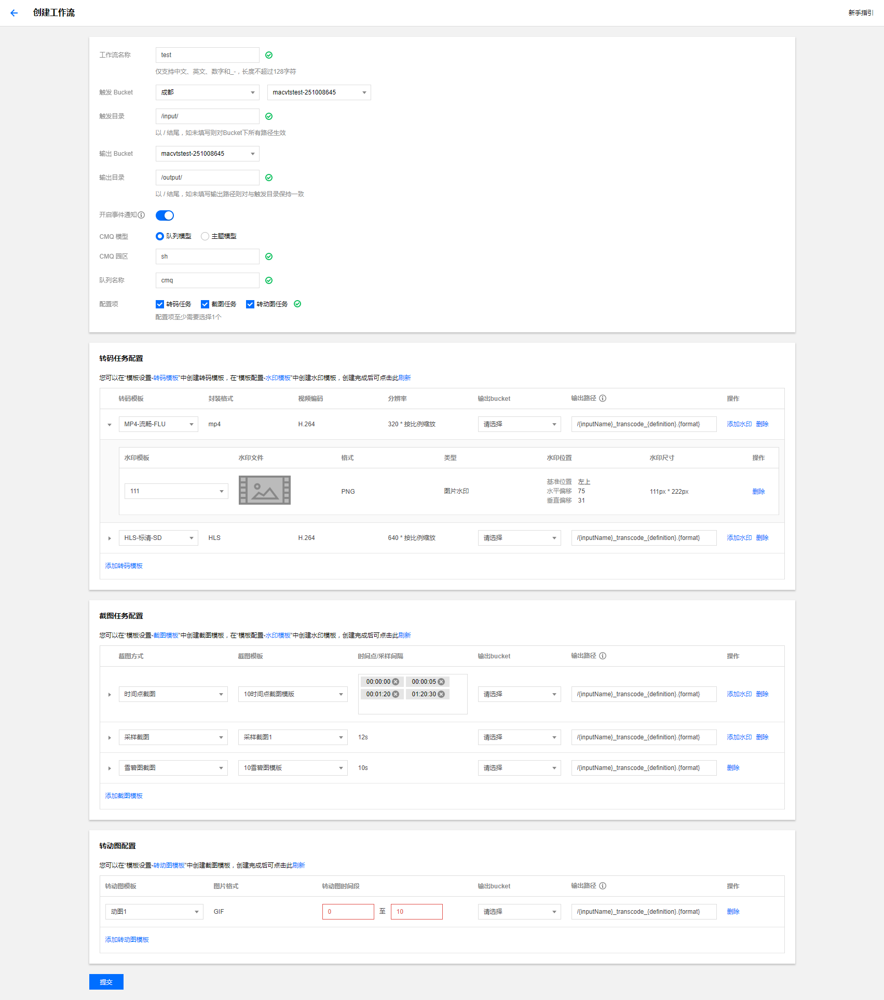

工作流包含了输入与输出COS bucket和path，转码、截图（包括动图和雪碧图）和水印等任务，事件通知CMQ地址等设置。下面给出相关设置的解释和示例。

### 工作流配置示例

配置示例：

### 工作流配置说明

#### 触发与输出Bucket & path配置
触发Bucket: 即需要触发转码的Bucket名称，这里需要选择其所在区域及名称。
触发Bucket 目录：即需要触发转码的Bucket 目录名称。默认为根目录，即整个Bucket所有目录下的文件都会触发转码任务。
输出Bucket：即用于存放转码后的文件的Bucket名称。目前仅支持同一个区域的Bucket。
输出Bucket 目录：即用于存放转码后的文件的Bucket 目录名称。缺省情况下，输出文件所在路径与输入文件保持一致。这时，需要确保输出文件名与源文件名不相同，否则源文件会被覆盖。

#### 事件通知配置

#### 转码任务配置

#### 截图任务配置

#### 转动图任务配置