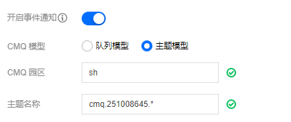
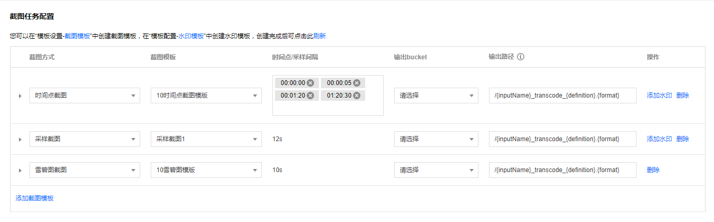
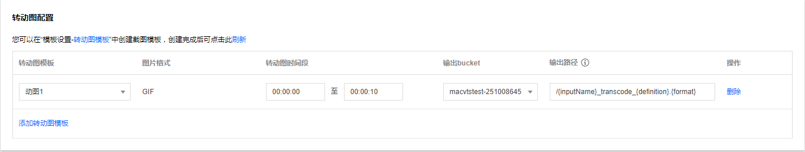

工作流包含了输入与输出COS bucket和path，转码、截图（包括动图和雪碧图）和水印等任务，事件通知CMQ地址等设置。下面给出相关设置的解释和示例。

### 工作流配置示例

配置示例：

### 工作流配置说明

#### 触发与输出Bucket & path配置
触发Bucket: 即需要触发转码的Bucket名称，这里需要选择其所在区域及名称。
触发Bucket 目录：即需要触发转码的Bucket 目录名称。默认为根目录，即整个Bucket所有目录下的文件都会触发转码任务。
输出Bucket：即用于存放转码后的文件的Bucket名称。目前仅支持同一个区域的Bucket。
输出Bucket 目录：即用于存放转码后的文件的Bucket 目录名称。缺省情况下，输出文件所在路径与输入文件保持一致。这时，需要确保输出文件名与源文件名不相同，否则源文件会被覆盖。

#### 事件通知配置
CMQ模型：包括队列模型和主题模型。
- 队列模型：顾名思义，一端写入一端读取，生产者写入消息到队列，消费者从队列读出消息并消费。在该模型中，同一个消息只能被消费一次。最简单的情况下，可以只有一个生产者和一个消费者；复杂情况下，可以同时有多个生产者和多个消费者。在多个消费者存在的情况下，每个消费者只能获取到全部消息中的部分消息，每个消费者获取的消息数量相对平均。
- 主题模型：这是一个比队列模型更高级的模型，支持更多条件的过滤。在该模型中，消息的生产者称为“发布者”，消息的消费者称为“订阅者”，消息的消费过程称为“投递”，同一个消息会被同时发送给全部的订阅者。该模型适合需要对全部消息进行过滤的场景。

CMQ更多信息请参考CMQ官网文档[消息队列概述](/document/product/406/4541)、[标签匹配说明](/document/product/406/6906)和[路由匹配规则](/document/product/406/8127)等。

所以，这里选择对应队列模型，并填写其所在区域和名称即可。
>! 区域当前只支持cos v4版本，即上海为'sh'，广州为'gz'，成都为'cd'，重庆为'cq'，北京为'bj'等。

主题设置如图：

#### 转码任务配置
这里设置转码相关的任务，比如不同分辨率的转码，水印，转封装等。
转码模板下拉框里面选择系统预置或自定义转码模板，然后右侧选择输出Bucket，设置输出文件路径及名称等。如果需要打水印，可以右侧点击添加水印按钮进行设置。然后选择系统预置或自定义水印模板即可。
如图：

#### 截图任务配置
截图任务配置包括采样截图、时间点截图和雪碧图等任务类型。
- 采样截图：按固定时间间隔截图，包括固定时间和固定时间百分比两种类型，比如间隔1s或1%截图一张。
- 时间点截图：即在固定时间点进行截图，比如在起始位置"00:00:00"，5分钟处"00:05:00"和15分30秒处"00:15:30"截取三张图片。
- 雪碧图：将多张截图合并到一张大的图片，每一张小图片可进行宽高设置。

如图：

#### 转动图任务配置
转动图是将视频文件进行截图然后封装到动态图片，包括GIF和WebP等格式，可以设置需要转动图的时间段。
如图：

