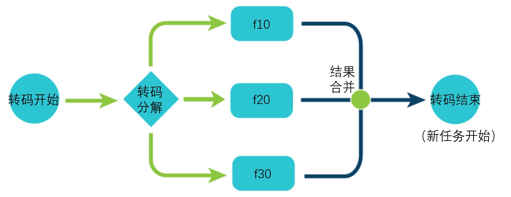
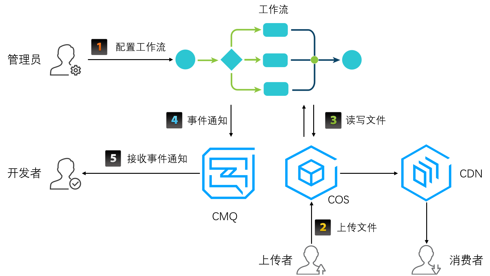

在腾讯云转码服务（VTS）中，工作流表示对一个源文件（注：音视频文件）发起的一系列作业任务的集合。这些任务以流水线的形式向前执行，因此称为“工作流”。工作流中的作业任务可以是并行的，也可以是串行的。作业任务有时候也称为“活动”，在VTS中一般简称“任务”。
工作流示意图：

图形说明：

- 圆形：表示任务的开始和结束。
- 菱形：表示任务的分解。
- 圆角矩形：表示具体任务的执行单元。
- 圆点：表示任务的组合或合成。
- 箭头：表示不同任务或相同任务的不同阶段的执行路径。

在VTS中，工作流可以包含转码、截图（包括动图，雪碧图）、水印等作业任务。比如，转码任务的工作流示例图如下：

>? 左侧圆形表示转码开始，如果包含多个规格的转码任务，比如f10，f20和f30，则这些任务会被分解然后并行执行，比如菱形和圆角矩形模块。各转码子任务完成后再将结果进行合并，如图右侧圆点所示。最右侧圆形表示任务结束，可以开始下一个顺序任务的执行，比如对各转码规格进行加密，拼接等后续处理。

### 工作流工作流程

工作流工作流程概览如下图：

流程说明：
1. 管理员通过控制台配置工作流。前置工作包括申请CMQ和COS bucket，并对VTS服务角色进行相应授权。
2. 上传者通过SDK或控制台将音视频文件上传到申请的COS bucket，此时COS会以事件通知的形式通知VTS，然后VTS会创建转码任务，触发转码工作流。
3. 在工作流处理任务的过程中，会对COS文件进行读写操作。比如下载源文件，上传转码后的文件等。该过程中，任务可并行和串行执行。
4. 工作流处理结束，VTS会将任务完成消息发送到前述的CMQ中，然后开发者可通过CMQ接口接收该事件消息。
5. 在客户确认文件转码成功后，可以继续后续业务逻辑，比如通过CDN分发转码后的视频等等。