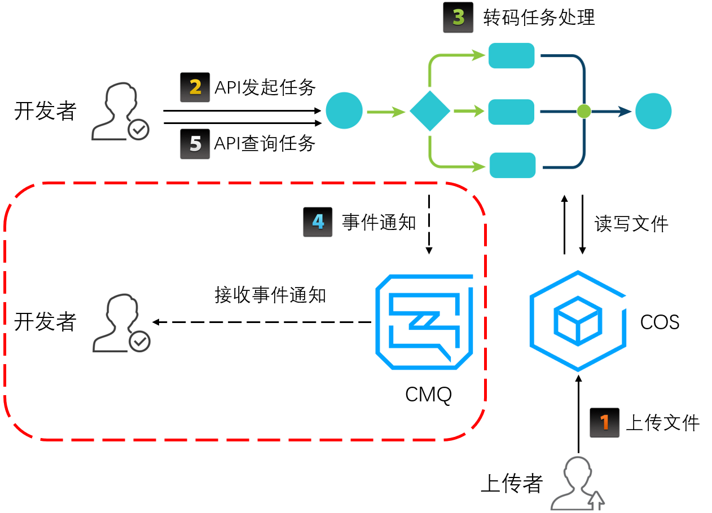

在VTS中，转码工作流程主要包括配置工作流、触发转码、转码任务处理和发送事件通知等几部分工作。

### 配置工作流
如果客户需要实现文件上传时自动触发转码任务，则需要预先配置工作流。工作流完成对指定COS Bucket中上传的文件自动发起特定的转码任务，并将转码结果文件上传到指定的相同或不同COS Bucket。工作流简介请参考文档[工作流](./工作流.md)，工作流设置请参考文档[设置工作流](../触发转码任务/设置工作流.md)。

如果客户不需要上传时自动触发转码，可以通过调用API的方式主动触发单个文件转码任务，这时不需要配置工作流。

### 触发转码
触发转码任务包括自动触发和主动触发两种方式：
- 自动触发：如果客户配置了工作流，那么文件上传时会自动触发转码任务。
工作流相关介绍请参考文档[工作流](./工作流.md)。
自动触发转码流程示例如下图：

- 主动触发：客户通过调用API发起转码任务，然后通过CMQ接收完成事件通知或通过TaskId主动查询任务完成状态。
该方式请参考文档[发起任务](../触发转码任务/发起任务.md)。
主动触发转码流程示例如下图：

>?
><li>图中第5步表示开发者可通过调用API查询任务状态，参数为发起任务返回的TaskId。</li>
><li>图中红色框区域表示可选，即在主动触发转码的情况下，开发者可选择通过CMQ接收事件通知，或者也可如图中第5步通过API查询任务状态信息。</li>

### 转码任务处理
该部分工作包括转码、截图、水印等任务处理和结果文件上传。在任务具体执行中，会将任务分解成多个子任务，子任务间可以并行或串行的方式处理，加快处理速度。

如果任务成功完成，则VTS会将转码结果文件上传到客户指定COS Bucket。如果结果文件上传失败，则任务最终状态为失败。

### 发送事件通知

在转码任务处理完成之后（可能成功或失败），VTS会将该文件转码结果信息返回给客户。对于客户来说，需要接收该消息通知并作出适当处理。