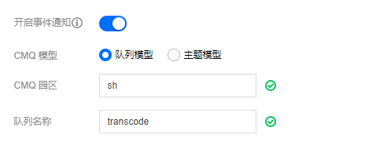

### 接收回调的途径有哪些？

考虑到服务可靠性、数据安全性等原因，MPS只支持基于消息队列的回调通知方式。

### 未收到回调？

您上传文件成功后，如果一定时间内未收到该文件的转码结果回调消息，那么可能的原因有：

  - 未正确设置工作流信息。请确认工作流已被正确设置。
  - 如果是通过API方式发起的转码任务，并且返回成功，可通过[任务查询API](https://cloud.tencent.com/document/product/862/37035)查询该任务处理进度信息。
  - 任务队列积压，导致处理时间变长或其他服务异常。可通过[提交工单](https://cloud.tencent.com/workorder/category)或联系客服等方式查询您的队列情况。

### 如何回调设置？

MPS使用腾讯云消息队列服务(CMQ)发送转码结果回调消息，您需要提前开通腾讯云CMQ服务账号，创建用于接收转码回调通知的消息队列。同时，需要授权该消息队列的写权限给MPS服务，以方便MPS向该消息队列写入数据。然后在创建工作流的时候设置对应的消息队列参数即可。如下图：

### 使用CMQ是否收费？

CMQ相关使用及费用信息请参考[CMQ官网费用说明页面](https://cloud.tencent.com/document/product/406/13648)。