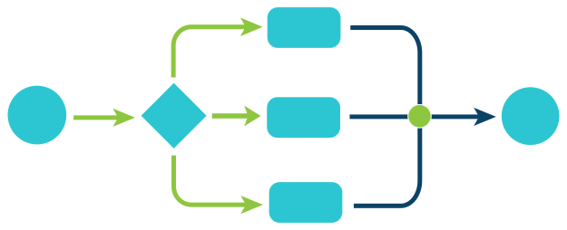
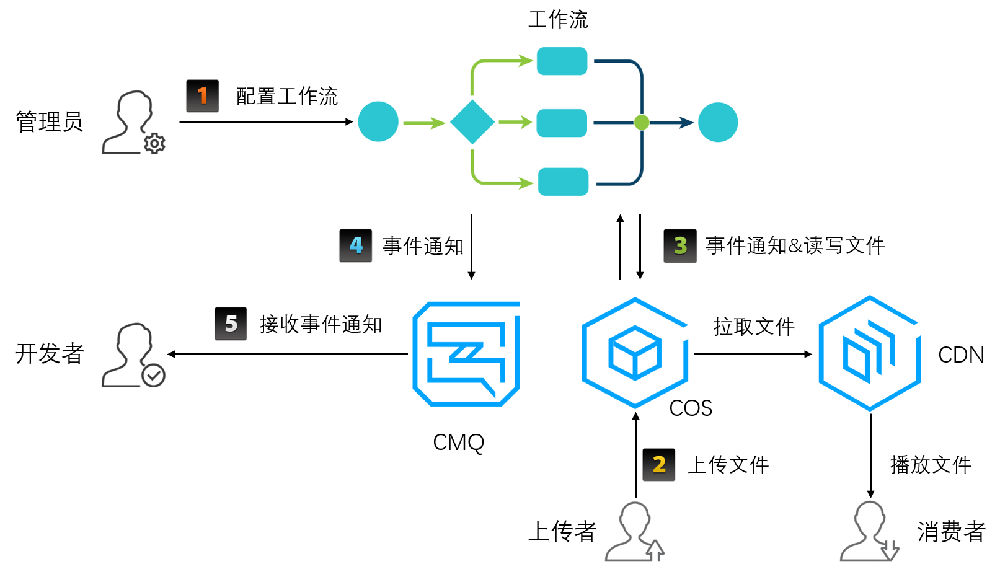
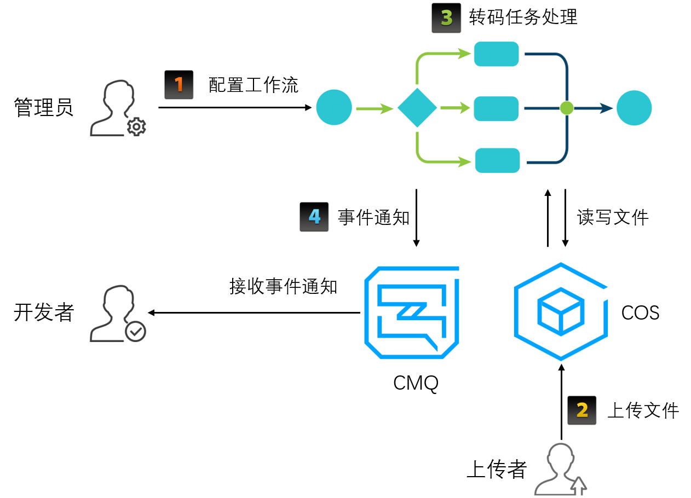

在腾讯云媒体处理服务（MPS）中，工作流表示对一个源文件（注：音视频文件）发起的一系列作业任务的集合。这些任务以流水线的形式向前执行，因此称为“工作流”。工作流中的作业任务可以是并行的，也可以是串行的。作业任务在MPS中一般简称“任务”。
工作流示意图：

图形说明：

- 圆形：表示任务的开始和结束。
- 菱形：表示任务的分解。
- 圆角矩形：表示具体任务的执行单元。
- 圆点：表示任务的组合或合成。
- 箭头：表示不同任务或相同任务的不同阶段的执行路径。

在MPS中，工作流可以包含转码、采样截图、时间点截图、转动图、雪碧图、水印等作业任务。比如，典型的转码任务的工作流示例如下图：

>? 左侧圆形表示转码开始，如果包含多个规格的转码任务，比如标清、高清转码以及多尺寸截图，则这些任务会被分解然后并行执行，比如菱形和圆角矩形模块。各转码子任务完成后再将结果进行合并，如图中右侧圆点所示，最右侧圆形表示任务结束。

### 工作流工作流程

在MPS中，转码工作流程主要包括配置工作流、触发转码、转码任务处理和发送事件通知等几部分工作。

工作流工作流程概览如下图：

流程说明：
1. 配置工作流
管理员通过控制台配置工作流。前置工作包括申请CMQ和COS bucket，并对MPS服务角色进行相应授权。
2. 触发转码
上传者通过SDK或控制台将音视频文件上传到申请的COS Bucket，此时会触发绑定到该Bucket上的工作流任务，即触发转码任务。（开发者也可以通过API [ProcessMedia](https://cloud.tencent.com/document/product/1090/33672) 来对单个文件发起转码任务。）
3. 转码任务处理
在工作流处理任务的过程中，会对COS文件进行读写操作，比如下载源文件，上传转码后的文件等。
4. 发送事件通知
工作流处理结束，MPS会将任务完成消息发送到前述的CMQ中，然后开发者可通过CMQ接口接收该事件消息。
>? 在确认文件转码成功后，可以继续后续业务逻辑，比如通过CDN分发转码后的视频等等。

#### 配置工作流
如果您需要实现文件上传时自动触发转码任务，则需要预先配置工作流。工作流完成对指定COS Bucket中上传的文件自动发起特定的转码任务，并将转码结果文件上传到指定的相同或不同COS Bucket。工作流简介请参考文档[工作流](https://cloud.tencent.com/document/product/862/37043)，工作流设置请参考文档[设置工作流](https://cloud.tencent.com/document/product/862/37038)。

如果您不需要上传时自动触发转码，可以通过调用API的方式主动触发单个文件转码任务，这时不需要配置工作流。

#### 触发转码
触发转码任务包括自动触发和主动触发两种方式：
- 自动触发：通过配置工作流，文件上传时会自动触发转码任务。
工作流相关介绍请参考文档[工作流](https://cloud.tencent.com/document/product/862/37043)。
自动触发转码流程示例如下图：

- 主动触发：通过调用API发起转码任务，然后通过CMQ接收完成事件通知或通过TaskId主动查询任务完成状态。
该方式请参考文档[主动发起转码](https://cloud.tencent.com/document/product/862/37040)。
主动触发转码流程示例如下图：

>?
><li>图中第5步表示开发者可通过调用API查询任务状态，参数为发起任务返回的TaskId。</li>
><li>图中红色框区域表示可选，即在主动触发转码的情况下，开发者可选择通过CMQ接收事件通知，或者也可如图中第5步通过API查询任务状态信息。</li>

#### 转码任务处理
该部分工作包括转码、截图、水印等任务处理和结果文件上传。在任务具体执行中，会将任务分解成多个子任务，子任务间可以并行或串行的方式处理，加快处理速度。

如果任务成功完成，则MPS会将转码结果文件上传到您指定的COS Bucket。如果结果文件上传失败，则任务最终状态为失败。

#### 发送事件通知

在转码任务处理完成之后（可能成功或失败），MPS会将该文件转码结果信息返回给您，您需要接收该消息通知并作出适当处理。