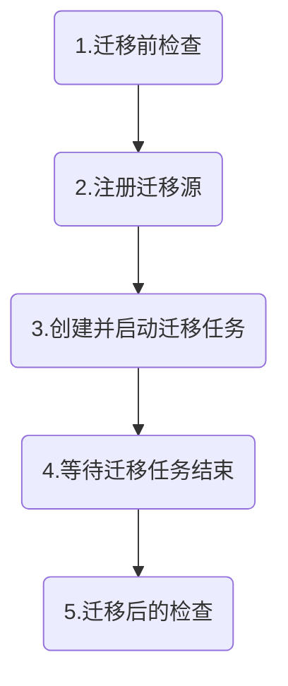

## 概述

使用控制台迁移流程如下图所示。



## 准备事项

- 已在腾讯云上准备好账号。
- 如果您使用子账号进行控制台迁移，则需要使用主账号登陆CAM [访问管理](https://console.cloud.tencent.com/cam/policy)，给子账号授予 QcloudCSMFullAccess 权限。
- 在CAM [访问管理](https://console.cloud.tencent.com/cam/capi) 中创建并获取API密钥。
- [下载]() 控制台迁移工具压缩包。
- 建议暂停源端服务器上的应用程序，以避免迁移时对现有应用程序可能产生的影响。

## 迁移步骤

> ?  建议迁移前先进行数据备份。
>
> - 源端主机：可以选择源服务器快照功能等方式备份数据。
> - 迁移目标是目标云服务器：可以选择 [创建快照](https://cloud.tencent.com/document/product/362/5755) 等方式备份目标云服务器数据。

### 1. 迁移前的检查

迁移前，需要检查源端主机, 如果迁移任务的迁移目标是目标云服务器时还需要检查目标云服务器。如果迁移目标是云服务器镜像时，只需要检查源端主机即可。检查内容如下：

<table>
  <tr><th>Linux 源端主机</th><td><ol  style="margin: 0;"><li>检查和安装 Virtio，操作详情可参考 <a href="https://cloud.tencent.com/document/product/213/9929">Linux 系统检查 Virtio 驱动</a>。</li><li>检查是否安装了 rsync，可执行 <code>which rsync</code> 命令进行验证。</li><li>检查 SELinux 是否已打开。如果 SELinux 已打开，请关闭 SELinux。</li><li>向腾讯云 API 发起迁移请求后，云 API 会使用当前 UNIX 时间检查生成的 Token，请确保当前系统时间无误。</li></ol></td></tr>
	<tr><th style="width: 15%;">目标云服务器（可选）</th><td><ol  style="margin: 0;"><li>存储空间：目标云服务器的云硬盘（包括系统盘和数据盘）必须具备足够的存储空间用来装载源端的数据。</li><li>安全组：安全组中不能限制443端口和80端口。</li><li>带宽设置：建议尽可能调大两端的带宽，以便更快迁移。迁移过程中，会产生约等于数据量的流量消耗，如有必要请提前调整网络计费模式。</li><li>目标云服务器和源端主机的操作系统类型是否一致：操作系统不一致会造成后续制作的镜像的信息与实际操作系统不符，建议目标云服务器的操作系统尽量和源端主机的操作系统类型一致。例如，CentOS 7 系统的对源端主机迁移时，选择一台 CentOS 7 系统的云服务器作为迁移目标。</li></ol></td></tr>
</table>

> ? 
>
> - 源端主机检查可以使用工具命令自动检查，如 `sudo ./go2tencentcloud_x64 --check`。
> - go2tencentcloud 迁移工具在开始运行时，默认自动检查。如果需要略过检查强制迁移，请将 client.json 文件中的`Client.Extra.IgnoreCheck`字段配置为`true`。

### 2.注册迁移源

**2.1** 下载或上传 go2tencentcloud 迁移工具。

Linux系统解压方式：

``` sh
unzip go2tencentcloud.zip
```

**2.2** （可选）排除源端主机上不需迁移的文件或目录。

在 Linux 源端主机迁移时，如果需要排除一些不需迁移的文件或目录，可以将这些不需要迁移的文件或目录追加至 [rsync_excludes_linux.txt 文件](https://cloud.tencent.com/document/product/213/65714#_linuxTxtState) 中。

**2.3** 导入迁移源。

例如，在64位 Linux 源端主机下，以 root 权限执行以下命令运行工具。

```sh
chmod +x go2tencentcloud_x64
sudo ./go2tencentcloud_x64
```

如下图提示，输入账户 API 访问密钥的 SecretId 和 SecretKey，并按 Enter 键。


> ? 您也可以执行前，在 user.json 文件配置账户 API 访问密钥。

当迁移工具界面出现如下图时，表示迁移源已经成功导入控制台，可在控制台查看迁移源。


控制台可查看刚才导入的迁移源，状态为 **在线** ，如下图：


如果未提示 Import source server successfully， 表示导入迁移源失败， 可查看日志（默认为迁移工具目录下的 log 文件）解决问题之后重新运行迁移工具导入迁移源。

> ? 迁移源导入成功之后，请勿关闭迁移工具直至迁移完成。否则，迁移源离线之后，无法完成迁移。

### 3.创建并启动迁移任务

**3.1** 创建迁移任务

登陆 [在线迁移控制台](https://console.cloud.tencent.com/cvm/csm/online?rid=46) ，根据迁移工具界面的迁移源ID，找到对应目标迁移源， 单击操作列的 **创建迁移任务** 。迁移任务配置参数详情参见  [附录1：迁移任务详细配置说明](#jobSettings) 。

例如，将一台 Linux 源端主机迁移到腾讯云广州地区，并生成目标云服务器镜像，迁移任务配置如下图：


**3.2** 启动迁移任务。

创建迁移任务之后，可在控制台迁移任务页面查看迁移任务,  如下图：


单机操作列的 **开始** 即可开始迁移任务，此时任务状态会变为 **迁移中** ，如下图：


> ?  预约执行的任务也可跳过本步骤，等到任务预约执行时间，迁移任务会自动开始执行。

> ! 
>
> - 控制台迁移时会帮助您自动迁移源端主机的系统盘和所有已挂载的数据盘，并自动生成与迁移源磁盘分区结构一致的目标磁盘。
> - 控制台模式迁移目前只支持公网迁移，如果需要使用内网迁移，可使用迁移工具迁移，详见 [内网迁移教程](https://cloud.tencent.com/document/product/213/65715) 。
> - 迁移目标是云服务器时，开始迁移后目标云服务器将进入迁移模式，请不要对目标云服务器进行重装系统、关机、销毁、重置密码等操作，直至迁移完成退出迁移模式。
> - 迁移目标是云服务器镜像时，开始迁移之后将在您的账户下创建一台名为 do_not_delete_csm_instance 的中转实例，请不要对中转实例进行重装系统、关机、销毁、重置密码等操作，直至迁移完成系统会自动销毁本次创建的中转实例。

### 4.等待迁移任务结束

当迁移任务状态为 **成功** 时，表示迁移成功完成。如下图：


> ? 
>
> - 由于传输数据耗时受源端数据大小，网络带宽等因素影响，请耐心等待迁移流程的完成。迁移工具支持数据传输的断点续传。
>
> - 迁移任务开始之后，可在迁移任务操作列单击 **暂停** 即可停止迁移任务。
>   - 迁移工具支持断点续传，暂停任务之后，重新点击 **开始**，即可从上次暂停点继续迁移。
>   - 迁移任务暂停仅支持在迁移任务数据传输阶段，在控制台迁移任务点击暂停之后，迁移工具会在数据传输阶段暂停数据传输。
>   - 如果迁移过程耗时太长，您想停止本次迁移，可以先暂停迁移任务，然后点击删除，即可取消本次迁移任务。

### 5.迁移后的检查

**5.1** 如果迁移结果失败，请检查日志文件（默认为迁移工具目录下的 log 文件）的错误信息输出、指引文档或者 [服务迁移类 FAQ](https://cloud.tencent.com/document/product/213/32962) 进行排查和修复问题。然后在迁移任务操作列点击 **重试** 即可重新开始迁移任务。

**5.2** 如果迁移结果成功：

- 如果迁移目标为云服务器，请检查目标云服务器能否正常启动、目标云服务器数据与源端主机是否一致、网络是否正常或者其他系统服务是否正常等等。
- 如果迁移目标为云服务器镜像，可点击迁移任务的迁移结果列的云服务器镜像ID，即可跳转到 [云服务器镜像页面](https://console.cloud.tencent.com/cvm/image/index) ，并使用该镜像创建云服务器。

**5.3** 如有任何疑问、迁移异常等问题请查看 [服务迁移类 FAQ](https://cloud.tencent.com/document/product/213/32962) 或者 [联系我们](https://cloud.tencent.com/document/product/282/1558) 解决。

## <span id="jobSettings">附录1：迁移任务详细配置说明</span>

<table>
<thead>
<tr>
<th width="15%">配置选项</th>
<th width="10%">是否必填</th>
<th>说明</th>
</tr>
</thead>
<tbody>
<tr>
<td>目的地域</td>
<td>是</td>
  <td>源端主机要迁入的腾讯云地域。地域请<a herf="https://cloud.tencent.com/document/product/213/6091">参见地域和可用区</a>。</td>
</tr>
<tr>
<td>任务名称</td>
<td>是</td>
<td>迁移任务的名称。</td>
</tr>
<tr>
<td>任务描述</td>
<td>否</td>
<td>迁移任务的描述。</td>
</tr>
<tr>
<td>目标类型</td>
<td>是</td>
<td>
  设置迁移源迁移至腾讯云的目标类型。
    <ul>
    <li><b>云服务器镜像</b>
      <br>迁移任务完成之后将为迁移源生成目标腾讯云镜像。配置说明：
        <ul type="square">
          <li>镜像名称：<b>必填</b> ,为迁移源生成的目标腾讯云镜像名称。镜像名称在目标地域重复时，迁移任务会自动添加任务id到镜像名称中。</li>
        </ul>
    </li>
    <li><b>云服务器实例</b>
      <br>选择一台目标地域的云服务器实例作为迁移目标。配置说明：
        <ul type="square">
            <li>目标实例：<b>必填</b> ,建议目标云服务器的操作系统尽量和源端主机的操作系统类型一致。例如，CentOS 7 系统的对源端主机迁移时，选择一台 CentOS 7 系统的云服务器作为迁移目标。</li>
        </ul>
    </li>
  </ul>
</td>
</tr>
<tr>
<td>预约执行时间</td>
<td>否</td> 
  <td>创建迁移任务后，在设置的时间自动启动迁移任务。预约执行时间最早可设置为当前时间后<b>10</b>分钟。</td>
</tr>
<tr>
<td>传输限制</td>
<td>否</td>  
<td>迁移过程中，数据传输的带宽上限限制，单位为Mbps。</td>
</tr>
<tr>
<td>Checksum验证</td>
<td>否</td>  
<td>开启后，可增强数据一致性校验，但是可能会降低传输速度。</td>
</tr>
</tbody></table>
